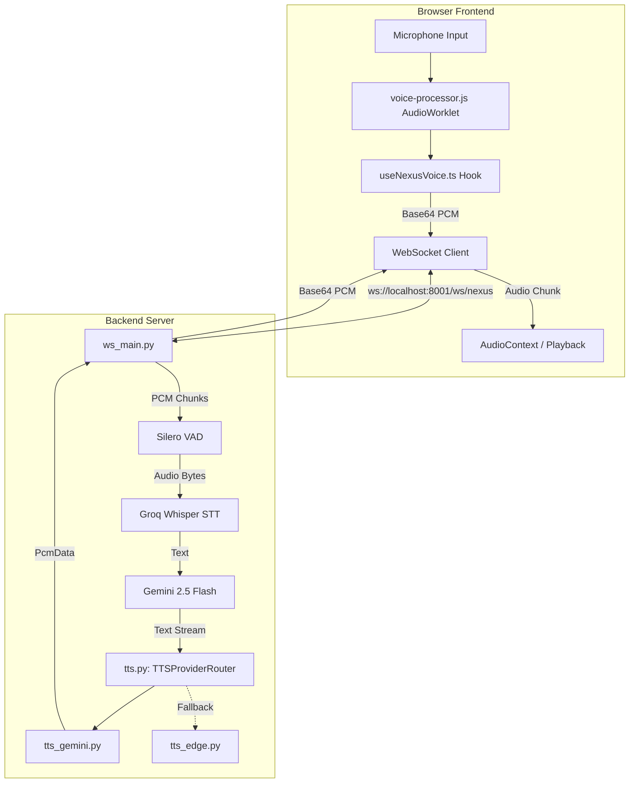

# Nexus Voice Architecture Map

## High-Level Data Flow

## Detailed File Map

1. **Frontend Audio Capture**
   - File: `d:\AI\frontend\public\worklets\voice-processor.js`
   - Contract: Raw Float32Array chunks from microphone.

2. **Frontend Orchestration**
   - File: `d:\AI\frontend\src\hooks\useNexusVoice.ts`
   - Contract: Converts Float32 to Int16 Base64, sends to WS. Receives Base64 PCM, converts to Float32, buffers into AudioContext.

3. **Backend WebSocket & Orchestration**
   - File: `d:\AI\backend\voice_agent\ws_main.py`
   - Contract: `VoiceSession` class manages state (`IDLE`, `LISTENING`, `THINKING`, `SPEAKING`).

4. **Voice Activity Detection (VAD)**
   - File: `silero_vad` library in `ws_main.py`
   - Contract: 512 samples per step, `threshold=0.5`.

5. **Speech-to-Text (STT)**
   - File: `ws_main.py` (Inline Groq API call)
   - Contract: Raw bytes wrapped in `io.BytesIO` sent to `whisper-large-v3`.

6. **Language Model (LLM)**
   - File: `ws_main.py` (Inline Groq/OpenAI compatible API call)
   - Contract: Returns streaming text chunks.

7. **Text-to-Speech (TTS) Routing**
   - File: `d:\AI\backend\voice_agent\providers\tts.py`
   - Contract: Returns an async generator yielding a metadata dictionary, then `PcmData` objects.

8. **TTS Providers**
   - File: `d:\AI\backend\voice_agent\providers\tts_gemini.py`
   - File: `d:\AI\backend\voice_agent\providers\tts_edge.py`
   - Contract: Must conform to `AsyncIterator[PcmData]`.
