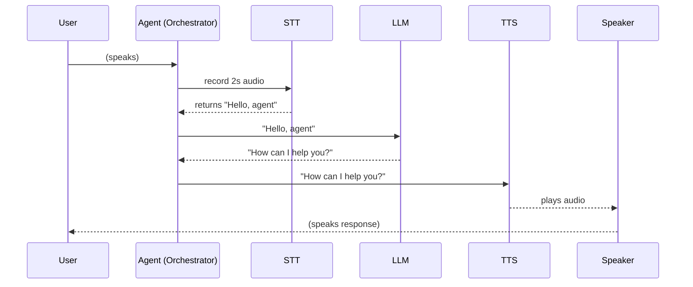
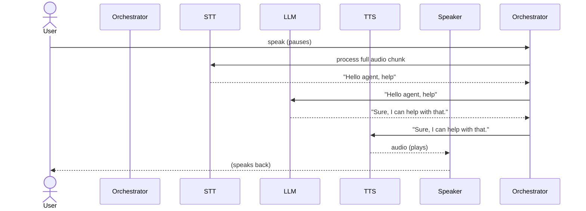
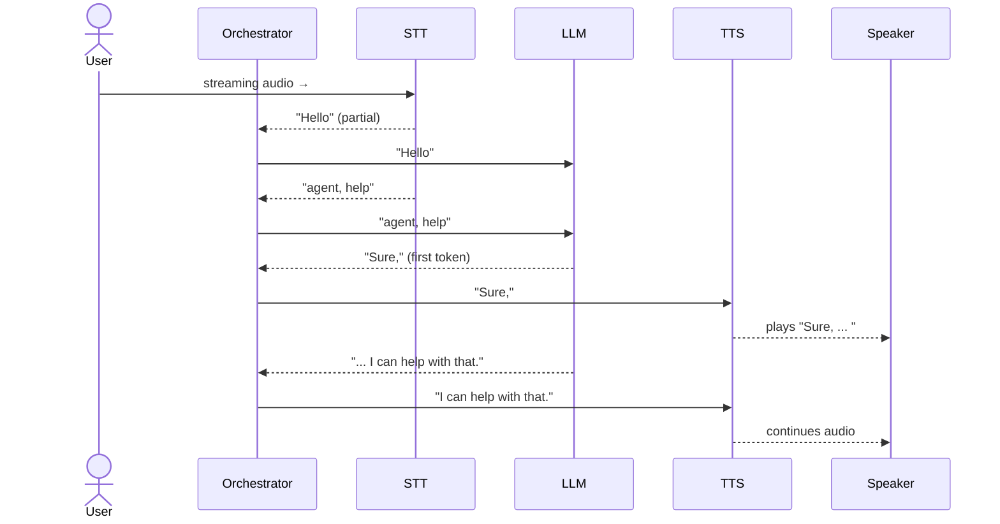

# Executive Summary

A **production-grade voice AI pipeline** must be modular, state-driven, and highly concurrent. Start with a simple **blocking pipeline** for stability, then gradually enable streaming and asynchronicity. Core components are: **Input/VAD**, **Speech-to-Text (STT)**, **Orchestrator/State Machine**, **LLM “brain”**, **Text-to-Speech (TTS)**, and **Output/Playback**. 

**Key principles:** prevent unbounded blocking, use *queues* between stages, and instrument everything. Aim for **<500ms total latency** from end-of-speech to response【19†L268-L274】【17†L265-L273】. Use free-tier friendly services: e.g. Groq or Deepgram for STT, Google Gemini or Claude Haiku for LLM, and Azure or Edge for TTS. Employ a **state machine** (FSM) to manage turn-taking and avoid race conditions【29†L72-L76】【21†L553-L561】. 

**Architecture Highlights:** 
- **Blocking Tier (V1):** Audio chunking → STT → LLM → TTS → Playback. No overlap, but simple and reliable【6†L138-L146】【17†L225-L234】. 
- **Streaming Tier (V2):** Incremental speech streaming to STT and LLM, partial-response TTS. Overlap stages to cut latency below 1s【6†L152-L161】【19†L212-L220】. 
- **Orchestration:** A lightweight FSM (states: LISTENING, PROCESSING, RESPONDING, IDLE) tracks turn-taking【29†L72-L76】【21†L553-L561】. Use debounce and queue logic to prevent partials from flooding the LLM【21†L573-L582】. 

**Provider Trade-offs (free-tier focus):** Groq’s free Whisper API (identical to OpenAI’s) and Deepgram Nova offer streaming STT【2†L141-L149】【31†L1-L4】. For LLMs, Google Gemini 2.5 Flash (free, limited rate) and Claude 4.5 Haiku ($6/Mtoken) give low latency【14†L77-L85】【36†L56-L60】. TTS options include Edge-TTS (free, Azure voices), Microsoft/Azure (5h STT, 0.5M chars TTS free per month【34†L323-L331】), or Deepgram Aura (~90ms TTFB)【27†L142-L149】. 

**Performance Targets:** STT partials <300–500ms【17†L265-L273】, LLM start <300ms (streaming), TTS first byte <200ms【17†L300-L308】, end-to-end <500ms【19†L268-L274】. Measure *latency per stage, queue depths, error rates* and instrument with Prometheus or similar【21†L505-L513】. 

Below is a **rigorous, cited design** covering components, interfaces, concurrency patterns, and a clear migration path from blocking to streaming. We include provider comparison tables, state-machine design, sequence diagrams, code skeletons, testing checklists, and cost estimates with caching strategies.

---

## Voice Pipeline Overview

A robust voice agent has these layers:

1. **Audio Input & VAD:** Capture mic audio, detect end-of-speech.  
2. **STT (Speech-to-Text):** Converts audio chunks to text. Prefer streaming APIs (delivering partial transcripts) for low latency【6†L88-L96】【19†L212-L220】.  
3. **Orchestrator (FSM):** Manages flow: *LISTENING → PROCESSING → RESPONDING → IDLE*.  Handles turn-taking, interrupts, and state transitions【29†L72-L76】【21†L553-L561】.  
4. **LLM “Brain”:** Receives text (and context) and generates response text. Use models optimized for low Time-to-First-Token (TTFT) and streaming【17†L325-L334】【19†L212-L220】.  
5. **TTS (Text-to-Speech):** Streams audio from response text. Critical to start playback quickly (Time-To-First-Byte (TTFB) <200–300ms)【17†L300-L308】【27†L142-L149】.  
6. **Audio Output:** Plays audio. Should allow pre-empting if user interrupts (future). 

This pipeline can evolve:

- **Block Mode (Stable Baseline):** Waits for full user utterance before processing end-to-end【6†L138-L146】. Simple but adds ~2–4s delay【6†L138-L146】. Build this first.  
- **Streaming Mode (Latency-Optimized):** STT streams partial transcripts, LLM streams tokens, TTS streams audio. Stages overlap, cutting latency to <1s【6†L152-L161】【19†L212-L220】.

*Figure:* Components and data flow (user speech → STT → LLM → TTS → speaker).

## Component Breakdown

### 1. Input & VAD (Voice Activity Detection)

- **Role:** Capture microphone audio continuously. Use a buffering mechanism and silence detection to determine utterance boundaries (end-of-turn). e.g. [webrtcvad](https://pypi.org/project/webrtcvad/) or [silero-VAD](https://huggingface.co/pyannote/speech-activity-detection).  
- **Why:** Poor endpointing (incorrect silence detection) causes agents to interrupt the user or leave awkward gaps【6†L169-L177】【17†L269-L277】. A local VAD is fast and avoids sending empty audio.  
- **Interface:** Emits `AudioChunk` objects (byte buffers, PCM) when speech is detected. The orchestrator buffers and sends them to STT in units (e.g. 1–3s or on silence). 

### 2. Speech-to-Text (STT)

| Provider            | Streaming | Free Tier / Cost                                   | Notes                                      |
|---------------------|-----------|----------------------------------------------------|--------------------------------------------|
| **Groq Whisper API**      | Yes       | Free (no CC, rate-limited)【23†L11-L19】         | Same transcription quality as OpenAI. Fast cloud GPU (LPU). Good first choice (free).  |
| **Deepgram Nova-2**      | Yes       | $200 free credit (~43,000 min)【31†L1-L4】        | High accuracy, low-latency (~0.3s streaming). 150 concurrent streams【32†L106-L114】. Handles noise well. |
| **Azure Speech-to-Text** | Yes       | 5 hours free/month【34†L323-L331】               | Real-time transcription. Decent accuracy, wide language support. Limit: 5h/month standard. |
| **Google Speech-to-Text**| Yes       | No free tier (pay-per-use)                       | High quality, supports streaming. 5min streaming latency ~100-200ms if optimized.  |
| **OpenAI Whisper (via API)**| No    | No free; pay-per-use (whisper-1)                 | Good accuracy. Streaming not supported directly (batch only). |
| **Local Whisper (faster-whisper)**| Partial| Free (local compute)                       | Offline CTranslate2 version of Whisper. **Low cost** but heavy GPU/CPU use. Good backup if cost-critical or offline needed. |
| **AssemblyAI/Other**      | Yes       | $10-20 free credit                            | Similar to Deepgram. Not as cost-effective for large scale due to credits. |

*Notes:* Use streaming STT to emit partial transcripts (word-by-word) as audio arrives【19†L212-L220】. On the free tier, Groq or Deepgram are ideal starters【2†L141-L149】【31†L1-L4】. Groq requires no credit card and provides access to Whisper with rate limits【23†L11-L19】. For local fallback, faster-whisper (CTranslate2) can run on CPU/GPU and is free. 

**Data Format:** Audio byte-stream in e.g. WAV/PCM → STT returns JSON/text. For streaming APIs (WebSocket), each partial transcript event should include timing and confidence.

### 3. Orchestrator / State Machine

- **Design:** An FSM that tracks conversation state. Core states: **LISTENING** (collect audio/VAD), **PROCESSING** (STT+LLM), **RESPONDING** (TTS playback), then back to LISTENING or IDLE. Add **ERROR** and **INTERRUPT** for robustness.  
- **State Transitions:**  
  - *LISTENING → PROCESSING:* On VAD end-of-speech.  
  - *PROCESSING → RESPONDING:* When LLM response is ready (or partial ready for streaming).  
  - *RESPONDING → IDLE/LISTENING:* After TTS finishes (or on user interrupt).  

- **Why FSM:** Explicitly modeling states prevents overlapping actions (e.g. speaking while still listening)【21†L553-L561】【29†L72-L76】. It enforces turn-taking and simplifies debugging. Many voice teams treat the conversational flow as an FSM to meet business rules and handle interruptions【29†L72-L76】.  

- **Key Features:**  
  - **Debounce/Buffer:** Only proceed to PROCESSING when speech has truly ended (e.g. 300ms silence)【21†L573-L582】.  
  - **Snapshotting:** Freeze the transcript when triggering LLM, so further STT partials don’t corrupt the prompt【21†L553-L561】.  
  - **Queueing:** Use in-memory queues (or thread-safe buffers) between STT→LLM and LLM→TTS. This decouples stages and allows for throttling/backpressure.  
  - **Timeouts:** Put timeouts on LLM and TTS calls; if one stalls, abort and recover with an error response.  
  - **Concurrency Safety:** Ensure per-session state isolation (no global mutable state for transcripts)【21†L521-L529】. Use locks or actor-like objects to avoid race conditions.

- **Sequence (Blocking Example):**  

*Figure:* **Blocking pipeline sequence:** user completes speech, then each stage executes in turn. Latency accumulates (~2–4s total【6†L138-L146】). 

### 4. LLM (Large Language Model)

| Provider             | Streaming| Free Tier / Cost                         | Context | Notes                             |
|----------------------|----------|------------------------------------------|---------|-----------------------------------|
| **Google Gemini 2.5 Flash/Lite** | Yes | Flash-Lite: 15 req/min (1000/day) free【14†L77-L85】<br>Flash: 10 RPM, 250/day, 250K tokens/min【14†L80-L88】 | ~256k tokens | Flash models are optimized for speed; Flash-Lite ideal for basic tasks. Streaming support via API. |
| **Groq Llama-3 (70B)**        | No (batch)  | Free-tier (rate-limited)【23†L11-L19】             | 8k tokens  | Ultra-fast inference on Groq LPU hardware【23†L11-L19】. Does not natively stream, but response generation is extremely quick (tens of ms). |
| **Anthropic Claude 4.5 Haiku**| No/Yes (via Bedrock) | $1 in / $5 out per 1M tok【36†L56-L60】; free use up to quotas† | ~8-32k    | Fast and cost-effective (Haiku). Streaming available on Cloud partners. Built-in prompt caching (90% savings). Great for “speaking” agents【36†L56-L60】. |
| **OpenAI GPT-4o (gpt-4o)**    | Yes        | No free; pricing ~$2.50/$10 per 1M tok【14†L111-L119】  | 8k (standard) | Top-quality. Not free; heavy use can be expensive. Use as fallback if free-tier LLM caps hit. |
| **OpenAI GPT-3.5 Turbo**      | Yes        | $18 trial credit, then pay (cheap per tok)         | 4k      | Lower quality. Can be used for inexpensive tasks. |
| **Local Llama2-7B**           | No (local)  | Free open-source (host yourself)                   | ~4k     | If absolutely needed, but requires GPU. Not recommended for high load by prompt. |

*Notes:* Choose one primary LLM to simplify (don't juggle multiple). For cost-free usage, **Gemini 2.5 Flash** (or Flash-Lite) is a top pick. [Gemini Flash remains free-tier](#) with fixed low quotas【14†L77-L85】, and Gemini Live (speech-to-speech) is also an option if available. **Groq Llama-3** is exceptionally fast (sub-second response), letting you reuse budgets as “prompt caching” (Groq provides free prompt-caching infrastructure【14†L111-L119】). **Claude Haiku** is purpose-built for speed and efficiency, with modest token costs【36†L56-L60】; it even advertises suitability for free-tier agents. 

**Interface:** Use chat-style APIs (JSON with `{"input": "...", "context": [...]}`). In blocking mode, wait for full `assistant_response`; in streaming mode, consume token-by-token via websockets (Gemini/GPT support this). Always attach conversation history (context) with pruning to fit limits. For stability, cap max output length and implement circuit-breakers if generation stalls.

### 5. Text-to-Speech (TTS)

| Provider             | Streaming | Free Tier / Cost                                     | Latency | Quality/Notes                             |
|----------------------|-----------|------------------------------------------------------|---------|-------------------------------------------|
| **Deepgram Aura-2**     | Yes       | Requires pay ($0.15/hr usage)                           | 90ms (TTFB)【27†L142-L149】 | Very low latency, limited voices (7 lang). Good for realtime agents; no free tier, but reasonable pricing for demos. |
| **Microsoft Azure TTS**  | Yes       | 0.5M chars free/month【34†L323-L331】; ~$4/M chars beyond | ~200ms  | Vast voice catalog (129 voices, 54 locales【27†L148-L152】). Supports custom neural voices. Streaming API available. Low cost per character but watch usage. |
| **Google Cloud TTS**     | Yes       | 4M chars free first year (CGP trial); ~$4.60/M chars    | ~300ms  | Natural voices (WaveNet), supports SSML. Slightly slower. Very wide language support. |
| **Edge-TTS (Open Source)**| Yes       | Free (uses Microsoft voices via web requests)         | ~100-200ms (varies) | Python library for Azure voices. Free but hacky (reverse-engineered). Enough for PoC or low-use. |
| **ElevenLabs**           | Yes       | Small free trial; then $5–330/mo subscription         | ~75ms   | Industry-leading quality. Streaming available (VocalLive). Very expensive beyond free tier. |
| **Cartesia Sonic**       | Yes       | Contact (custom)                                    | ~80ms   | Ultra-low-latency (designed for phones). Proprietary “end-to-end” TTS. |

For **Voice Agents**, streaming TTS is critical: start playing audio as soon as possible【17†L300-L308】. Aim for Time-To-First-Byte (TTFB) <200–300ms【17†L300-L308】【27†L142-L149】. Among commercial APIs, Deepgram Aura-2 (~90ms) and ElevenLabs Flash (~75ms) lead【27†L142-L149】. For cost-effectiveness, Azure’s standard voices are good, with 0.5M free chars/mo【34†L323-L331】 and many language/voice options. Edge-TTS is a zero-cost Python library (though not officially supported) if budget is very tight.

**Data Format:** Provide text (or SSML) and receive audio stream (PCM or MP3 chunks). In blocking mode, you may generate an MP3 file then play; in streaming mode, pipe chunks to the audio buffer.

### 6. Output / Playback

- **Playback:** Push audio chunks to speaker. In blocking mode, play a complete file (e.g. via `pygame` or `pyaudio`). In streaming mode, gradually write PCM to the audio output device.  
- **Interrupts:** (Advanced) Allow new audio from user to interrupt TTS playback (barge-in). This requires the orchestrator to hold playback in a separate thread and kill it on interrupt event.  

No citation needed for playback specifics. Ensure high-priority thread, minimal buffering, and flush outputs promptly.

---

## Sequence Diagrams

**Blocking Pipeline:** (Audio → STT → LLM → TTS)  

*Figure:* In this **sequential** mode, each stage waits for the previous one to finish【6†L138-L146】. Total latency adds up (STT + LLM + TTS)【6†L138-L146】.

**Streaming Pipeline:** (Overlap stages)  

*Figure:* In **streaming** mode, STT partials and LLM tokens flow continuously. TTS plays as soon as enough text is available, greatly reducing the perceived delay【6†L152-L161】【19†L212-L220】.

---

## Integration Patterns & Reliability

- **Concurrency & Queues:** Use separate threads or async tasks per stage. For example, a STT thread reads audio and enqueues transcripts; a worker dequeues and feeds LLM; another enqueues TTS jobs. **Asynchronous queues (e.g. `asyncio.Queue` or Redis/Kafka)** decouple producers and consumers, providing natural backpressure【21†L505-L513】.  
- **Actor Model:** Alternatively, represent each session as an actor object handling its own queue. Use an actor framework (Ray, Celery, or custom threads) so that each conversation is isolated.  

- **Backpressure:** Protect against overload: limit queue lengths (max pending requests), apply **circuit breakers** on APIs (fail-fast if downstream slow)【21†L517-L526】【21†L606-L615】. For example, if the LLM queue grows too long, temporarily stop accepting new transcripts or switch to a simpler model【21†L606-L615】. 
- **Timeouts & Fallbacks:** Always impose timeouts on network calls. If STT/LLM/TTS fails or times out, catch it and play an error message or retry logic. Use exponential back-off on retries.  
- **State Locking:** Ensure only one LLM call at a time per conversation. Use mutex or serialize tasks to avoid race conditions updating shared chat history【21†L522-L530】.  

- **Observability:** Instrument every stage with metrics and logs【21†L505-L513】. Collect:  
  - *Latency per stage* (e.g. STT processing time, LLM TTFT, TTS TTFB and stream time).  
  - *Queue lengths* (pending audio frames, transcripts, responses).  
  - *Error counts and reasons*.  
  - *Audio quality* (if possible, e.g. logs when VAD fails or transcripts are missing).  
  Use tools like **Prometheus/Grafana** or cloud monitoring to alert on spikes in latency or errors. “If you can’t measure it, you can’t fix it”【21†L505-L513】.  

- **Security:** Use TLS for all API calls. Protect keys in environment variables/secret store. Sanitize any user-supplied content. Comply with privacy for audio (avoid logging raw speech, only log transcripts with user consent). For compliance: enforce FSM templates for critical prompts【29†L72-L76】.

---

## Migration Path (Blocking → Streaming)

1. **Phase 1: Stable Blocking Pipeline**  
   - Implement end-to-end flow with single-thread per session: audio → STT → LLM → TTS.  
   - Use easily debuggable blocking APIs. Add VAD to chunk audio.  
   - Verify correctness and gather baseline latencies. Ensure FSM transitions work.  
   - **Milestone:** System can handle 1–2 users sequentially, and responses match expectations.  

2. **Phase 2: Basic Asynchronicity & Buffering**  
   - Introduce in-memory queues between stages. Move STT->LLM and LLM->TTS to separate tasks/threads.  
   - Add simple buffering: accumulate 2–3s before sending to STT, or use silence-end triggers.  
   - **Milestone:** Achieve stable continuous operation with moderate load. Verify metrics instrumentation (latency per stage).  

3. **Phase 3: Partial Streaming (STT and LLM)**  
   - Switch STT to streaming API (if available). Process partial transcripts.  
   - Begin LLM generation on first partials (use streaming-capable model). Feed new text as it comes.  
   - Debounce transcripts (only send to LLM if changed/increased by 200ms of stability)【21†L573-L582】.  
   - **Milestone:** Agent starts responding before user fully stops speaking. Observe drop in wait time. Ensure no transcript flooding (through filtering).  

4. **Phase 4: Streaming TTS & Overlap**  
   - Use a TTS API that supports streaming output. Start playback on first audio chunks.  
   - Overlap TTS generation with LLM generation (pipeline in flight).  
   - Update FSM to allow preemption (e.g. user interrupt).  
   - **Milestone:** End-to-end latency consistently <1s. Audio plays seamlessly as text generates.  

5. **Phase 5: Optimization and Scaling**  
   - Implement concurrency controls (thread pools, rate limiting).  
   - Add improvements: silence detection tuning, adaptive chunk sizes, fallback models on overload.  
   - If needed, introduce on-prem or local models (e.g. local Whisper) to cut API usage.  
   - **Milestone:** System handles target user volume without degrading service.  

Throughout, **test frequently** at each phase (see Testing Checklist below). Don’t rush to full streaming – fix fundamental issues first. Only migrate to complex patterns when the blocking version is rock-solid【21†L629-L633】【19†L212-L220】.

---

## Provider Tradeoffs

**Table: Speech-to-Text (STT) Options**  

| Service         | Streaming | Free Tier (2026)                           | Latency        | Comments and Use Cases                     |
|-----------------|-----------|--------------------------------------------|----------------|--------------------------------------------|
| **Groq Whisper**    | Yes       | Free (no CC) with rate limits【23†L11-L19】    | ~400ms – 1s (depending on chunk size) | Uses OpenAI Whisper; high accuracy, free up to rate limit. Good quick start (ensure to upgrade model name).   |
| **Deepgram Nova-2** | Yes       | $200 trial (≈43k min)【31†L1-L4】             | ~300ms real-time | Exceptionally fast streaming (0.3s transcripts)【17†L265-L273】. Good for low-latency.             |
| **Azure STT**       | Yes       | 5h/month free【34†L323-L331】                | 300–800ms        | Good language coverage; moderate latency. Free tier helps light use.   |
| **Google STT**      | Yes       | No free tier; pay per sec (free $300 trial) | ~100–300ms (optimized) | Very high accuracy. Streaming support via Speech-to-Text. Expensive at scale. |
| **AssemblyAI**      | Yes       | $10 credit                                   | ~250ms        | High accuracy, easy API. Lower quota; often used for demos.  |
| **Local Whisper**   | Partial   | Free (self-host)                             | ~500ms+ (varies) | No API calls; runs on device. Useful if privacy or cost is critical (needs GPU for speed). |

**Table: LLM (Language Model) Options**  

| Service/Model       | Streaming | Free Tier / Cost (2026)                       | Context Window | Notes                             |
|---------------------|-----------|-----------------------------------------------|----------------|-----------------------------------|
| **Gemini 2.5 Flash**     | Yes       | Flash-Lite: 15 RPM, 1000/day (free)【14†L77-L85】<br>Flash: 10 RPM, 250/day (free)【14†L80-L88】 | ≥256k tokens  | Google’s mid-tier models; free tier supports basic usage. Gemini 3.x now paid only【14†L77-L85】. Good first choice. |
| **Groq Llama-3 (70B)**   | No (batched) | Free (rate-limited)【23†L11-L19】                   | 8k tokens     | Ultra-low latency on Groq LPU. Suitable when response quality is important and cost must be minimal. |
| **Claude 4.5 Haiku**    | Partial   | $1 input / $5 output per 1M tokens【36†L56-L60】    | ~8k tokens    | Very fast and cost-efficient. Built-in caching (90%+ savings). Good for continuity. Has conversational polish. |
| **OpenAI GPT-4o**       | Yes       | No free; pay $2.50/$10 per 1M tokens【14†L111-L119】 | 8k (GPT-4o)   | Best quality, can stream. Use sparingly (free-tier limited to $18 credit). |
| **GPT-3.5 Turbo**       | Yes       | $0.002/$0.002 (chat) per 1k tokens (no free credit left in 2026) | 4k tokens     | Fast, cheap, modest quality. Can handle fallback tasks. |
| **Mistral 7B (self-host)**| No (local) | Free (open-source)                                | 8k tokens     | If you need an *offline* small model, Mistral-7B is high-performance on CPU/GPU. Not cloud API. |

**Table: Text-to-Speech (TTS) Options**  

| Service/Model         | Streaming | Free Tier (2026)                           | Voices/Languages | Latency (TTFB)      | Notes                                 |
|-----------------------|-----------|--------------------------------------------|------------------|---------------------|---------------------------------------|
| **Deepgram Aura-2**     | Yes       | No free; $0.15/hr processing              | 7 languages       | ~90ms【27†L142-L149】     | Excellent for low-latency (<100ms). Few voices; simpler use-case.             |
| **Azure TTS**           | Yes       | 0.5M chars/month free【34†L323-L331】    | 129 voices, 54 locales【27†L148-L152】 | ~200ms            | Rich voice selection (neural voices). Good engineering support.             |
| **Google Cloud TTS**    | Yes       | 4M chars first year (trial)             | 220+ voices, 40+ languages | ~300ms        | High quality (WaveNet). More limited in trial but strong reliability.       |
| **Edge-TTS (OSS)**      | Yes       | Free (no official limit)                | Uses MS voices    | ~100–300ms (varies) | Python package tapping Azure voices. Good for PoC or very low budget.       |
| **ElevenLabs**         | Yes       | Limited trial; $5–330/month sub        | 70+ voices (multilingual) | ~75ms【27†L142-L149】  | Premium quality. Has free voices in API (text prompts), but limited char free. |
| **Cartesia Sonic**      | Yes       | Contact (no public free tier)          | 30+ voices (24 languages)  | ~80ms【27†L142-L149】  | Very low latency (designed for IVR). Often requires enterprise purchase.  |

*Notes:* For **real-time agents**, streaming TTS is non-negotiable【17†L300-L308】【27†L142-L149】. Deepgram’s Aura-2 and ElevenLabs Flash excel at low latency, but cost more. Azure and Google offer broad voice sets and modest free quotas【34†L323-L331】【27†L148-L152】. Edge-TTS is a clever free workaround (no service cost, but rely on Microsoft’s free voices) if absolutely needed. 

---

## System Interaction Interfaces

For clarity, here are **abstract interfaces** (message formats) between components:

- **Audio → STT:** Raw audio (PCM/WAV) frames. If using WebSocket STT, send binary chunks; if REST, send audio file or stream.  
- **STT → Orchestrator:** JSON transcript packets (possibly partial). For example: `{"text": "hello ag", "timestamp": 1.5, "is_final": false}`. Final results flagged `is_final:true`.  
- **Orchestrator → LLM:** JSON chat payload, e.g.:  
  ```json
  { 
    "model": "gemini-2.5-flash", 
    "messages": [{"role":"user","content":"Hello agent, I need help with ..."}], 
    "stream": true 
  }
  ```  
- **LLM → Orchestrator:** JSON with tokens: e.g. `{ "choices":[{"delta":{"content":"Sure, I"},"index":0}] }` for streaming, or full completion in `content`.  
- **Orchestrator → TTS:** Text or SSML string. Example REST payload: `{"text":"Sure, I can help with that.", "voice":"en-US-JennyNeural", "stream":true}`.  
- **TTS → Speaker:** Audio byte stream or completed audio clip (format: raw PCM, WAV, or MP3). Player reads from a buffer or file.  

In implementation, these interfaces should be wrapped by adapter classes (see Code Skeletons below), hiding provider details but ensuring data flows correctly.

---

## Observability & Failure Modes

- **Latency Tracking:** As noted, measure and log the time of each stage. Aim: total latency (user-stop to audio-start) <500ms【19†L268-L274】. Track if any stage exceeds its budget (e.g. STT >0.5s, LLM >1s, TTS >0.3s).  
- **Error Handling:** Catch API errors/timeouts. If STT fails, respond “Sorry, I didn’t catch that.” If LLM times out, say “I’m having trouble thinking right now, let me try again.” Always have a fallback utterance.  
- **Concurrency Issues:** Watch for stuck threads or orphaned processes. Use monitoring to detect memory leaks (e.g. leftover Selenium/Edge processes). Gracefully restart components on failure.  

- **Common Pitfalls【21†L517-L526】【21†L573-L582】:**  
  - *Cascading Latency:* Even one blocking call (e.g. sync HTTP) stalls all. Use asynchronous I/O or threads in critical path【21†L517-L526】.  
  - *State Races:* Ensure conversation context updates are atomic. If two audio chunks accidentally trigger two LLM calls simultaneously, responses will mix up【21†L521-L529】. The FSM helps prevent this (only one LLM call per turn).  
  - *STT Flooding:* High-quality streaming STT can output dozens of partials/sec【21†L573-L582】. Only forward partials when stable (e.g. 100–200ms silence) or high confidence【21†L578-L586】. This avoids overwhelming the LLM.  
  - *Backpressure:* Under heavy load, the LLM queue can backlog. Use circuit breakers (drop or delay new turns) rather than letting queues grow unlimited【21†L606-L615】. For example, if queue >N, temporarily switch new requests to a faster echo response or pause listening for new users.  

- **Observability Tips【21†L505-L513】:** Instrument with detailed metrics:
  - **Pipeline Latency:** per-turn total latency, STT-first-word latency, LLM-first-token latency, TTS-first-byte latency.  
  - **Throughput:** number of turns/minute, active concurrent sessions.  
  - **Queue Depths:** length of transcript/response queues for each session.  
  - **Errors:** count API failures by type.  
  - **Resource Usage:** CPU/GPU load, memory for audio buffers.  

Collect logs/traces (e.g. with OpenTelemetry) to trace a request across STT→LLM→TTS. This helps pinpoint bottlenecks.

---

## Caching & Cost Optimization

- **Prompt/Response Caching:** If certain queries are repeated, cache the LLM response and TTS audio. For example, if user often asks “What’s the weather?”, reuse the previous audio file. (This is scenario-specific.)  
- **Gemini Context Caching:** Google’s Vertex AI and Claude support prompt caching (up to 90% cheaper)【36†L56-L60】. Use this feature when possible.  
- **Token Limits:** Use embeddings/index (like LlamaIndex) to manage long conversation history. Only send recent relevant history.  
- **Streaming vs. Batch:** Streaming STT/TTS actually costs similar per second, but streaming LLM often uses more tokens (due to overhead of partials). If token cost is an issue, consider toggling streaming off and waiting for full answer (this speeds content but slower perception).  
- **Cost Estimation (per 1000 tokens):** Gemini 2.5 Flash-Lite: free (low quotas)【14†L77-L85】. Gemini 2.5 Flash: $0.30 in/$1.50 out per 1M tokens【14†L100-L109】. Claude Haiku 4.5: $1 in/$5 out【36†L56-L60】. GPT-4o: $2.50/$10【14†L111-L119】. Translate to ~$0.0005–0.01 per token; TTS ~\$4–16 per 1M chars【27†L142-L149】. 

To **minimize costs while staying under free-tier**, stick to the low-end models and take advantage of free credits (Deepgram’s $200, Azure free quotas【34†L323-L331】). Monitor usage and switch to cheaper models under load (as Gladia suggests【21†L606-L615】). 

---

## Migration Checklist

Before and during rollout, verify:

- [ ] **Audio Capture:** Audio levels correct, no clipping. VAD reliably detects end-of-speech (test with varying mic volumes/noise).  
- [ ] **STT Accuracy:** Test with representative speakers/accents. Ensure streaming results align with offline transcripts.  
- [ ] **State Transitions:** FSM correctly moves states (e.g. user interrupt flips RESPONDING→PROCESSING). No two states active.  
- [ ] **LLM Prompting:** Confirm prompt format. Test with max-length dialogues to ensure context trimming works.  
- [ ] **TTS Playback:** No glitches or long silence. For streaming mode, ensure audio plays smoothly as chunks arrive.  
- [ ] **Failover:** Simulate network failures (e.g. cut off LLM mid-stream). Orchestrator should recover or reset safely.  
- [ ] **Performance Under Load:** Emulate multiple simultaneous users. Monitor CPU/RAM, latency. Ensure graceful degradation (e.g. longer wait times, not crashes).  
- [ ] **Latency Measurement:** Measure round-trip times. Compare to targets (<500ms). Identify and optimize any stage overshoot.  
- [ ] **End-to-End UX:** Hold real conversational tests. Check for unnatural delays or skipped words. Obtain user feedback on responsiveness.

As Gladia advises, *“Test like it’s real: simulate real audio, real network conditions, and real user behavior under load”*【21†L629-L633】.

---

## Code Skeletons (Python Interfaces)

Below are example Python classes to illustrate structure. These are *skeletal* interfaces; actual implementations depend on chosen APIs.

```python
class STTAdapter:
    """Interface to Speech-to-Text service."""
    def __init__(self, config):
        # e.g. API key, model selection
        pass

    def transcribe_stream(self, audio_stream):
        """
        Asynchronously send audio chunks and yield partial transcripts.
        e.g. use WebSocket or REST streaming endpoint.
        Yields: {'text': str, 'is_final': bool, 'timestamp': float}
        """
        pass

    def transcribe(self, audio_bytes):
        """Synchronous transcription: returns final text."""
        pass


class LLMAdapter:
    """Interface to LLM chat completion API."""
    def __init__(self, config):
        # e.g. api_key, model="gemini-2.5-flash"
        pass

    def generate(self, prompt, context=[]):
        """
        Blocking call: send prompt+context, get full response.
        Returns string.
        """
        pass

    def generate_stream(self, prompt, context=[]):
        """
        Streaming call: yields partial tokens.
        Yields: chunks of response text.
        """
        pass


class TTSAdapter:
    """Interface to Text-to-Speech service."""
    def __init__(self, config):
        # e.g. voice settings
        pass

    def synthesize(self, text, output_format='pcm'):
        """
        Blocking TTS: returns audio bytes for full text.
        """
        pass

    def synthesize_stream(self, text):
        """
        Streaming TTS: yields audio chunks (bytes).
        """
        pass


class PlaybackController:
    """Handles audio playback to speaker."""
    def __init__(self):
        # e.g. set up PyAudio or pygame
        pass

    def play(self, audio_bytes):
        """Play full audio (blocking)."""
        pass

    def play_stream(self, audio_stream):
        """Play audio chunks as they arrive."""
        pass
```

```python
class VoiceAgent:
    def __init__(self, stt_adapter, llm_adapter, tts_adapter, playback):
        self.stt = stt_adapter
        self.llm = llm_adapter
        self.tts = tts_adapter
        self.playback = playback
        self.state = "IDLE"
        self.conversation_history = []  # list of (user_text, agent_text)

    def run(self):
        while True:
            if self.state == "IDLE":
                # Wait for user to start speaking
                self.state = "LISTENING"

            elif self.state == "LISTENING":
                audio = self._collect_audio_until_silence()
                if audio:
                    text = self.stt.transcribe(audio)
                    self.user_text = text
                    self.conversation_history.append(("user", text))
                    self.state = "PROCESSING"

            elif self.state == "PROCESSING":
                prompt = self.user_text
                # Optionally include recent history in prompt
                response = self.llm.generate(prompt, context=self.conversation_history)
                self.agent_text = response
                self.conversation_history.append(("agent", response))
                self.state = "RESPONDING"

            elif self.state == "RESPONDING":
                audio = self.tts.synthesize(self.agent_text)
                self.playback.play(audio)
                self.state = "IDLE"
```

This skeleton shows a **simple blocking loop**. For streaming or concurrency, you’d expand `_collect_audio_until_silence` to stream, use `transcribe_stream`, `generate_stream`, `synthesize_stream`, and run playback in a separate coroutine. The **FSM logic** (state transitions) is explicit and can be extended with INTERRUPT or ERROR states. Each adapter encapsulates a provider API (abstracted away from orchestration).

---

## Performance & Cost Summary

- **Latency Budget:** Aim <500ms end-to-end【19†L268-L274】. (STT ~200-300ms, LLM TTFT ~200-300ms, TTS TTFB ~100-200ms).  
- **Throughput:** Depends on user concurrency. Ensure your chosen LLM can handle expected queries per minute. For example, Gemini Flash-Lite free tier only allows ~15 RPM【14†L77-L85】; Groq’s free tier similarly is rate-limited【23†L11-L19】.  
- **Free Tier Quotas:**  
  - *Gemini 2.5 Flash-Lite:* 15 requests/min, 1000/day【14†L77-L85】.  
  - *Azure Speech:* 5 hours (STT) and 0.5M chars (TTS) free per month【34†L323-L331】.  
  - *Deepgram:* $200 credit (~700h) initially【31†L1-L4】.  
  - *Groq Cloud:* Free with token/RPM caps【23†L11-L19】.  
  - *Claude:* None on open free tier; pay-as-you-go pricing($1/$5 per M)【36†L56-L60】.  
- **Cost per Request (approx):**  
  - LLM: ~\$0.03 per 1000 tokens (Gemini Flash) to \$0.10 (GPT-4o)【14†L100-L109】【14†L111-L119】.  
  - STT: Usually few cents per minute (Groq/Deepgram ~\$0.003–0.01/min after free credits).  
  - TTS: Azure/Google ~\$4–16 per million characters【27†L142-L149】 (negligible for short responses). Streaming TTS may cost extra, check provider docs.  
- **Caching:** A well-placed cache (LLM or TTS) can drastically cut these costs for repeat queries. 

In summary, **Gemini Flash or Groq LLM + Groq/Deepgram STT + Azure TTS** likely minimize cash flow (leveraging free quotas), while still meeting low-latency needs. Monitor usage carefully, and shift to pay-as-you-go models only when free tiers are exhausted.

---

## Streaming Architecture & Orchestration Layer

To ensure a robust real-time voice system, the architecture must extend beyond speech-to-text processing and incorporate a dedicated streaming and orchestration layer. While Deepgram Nova-2 provides high-accuracy, low-latency transcription, it does not handle session management, audio transport, or real-time interaction flows. Therefore, a streaming infrastructure such as GetStream or LiveKit should be integrated to manage bidirectional audio flow, concurrency, and connection stability. 

Additionally, multilingual capability—especially mixed-language input such as Hinglish—cannot be reliably handled by the STT layer alone. The system must include an LLM layer responsible for contextual understanding, language adaptation, and response generation, followed by a text-to-speech component for output delivery. This ensures that language switching, conversational coherence, and user intent are handled intelligently. 

The final architecture should follow a modular pipeline: 
**Streaming Layer (Session + Transport) → STT (Deepgram) → LLM (Reasoning + Language Control) → TTS (Response Output)**

This design enables scalability, supports real-time interaction (including interruption handling), and ensures the system remains adaptable to multilingual and high-concurrency use cases.

---

### Citations:

Our design is based on current best practices and vendor guidance:

- Voice agent architecture (STT→LLM→TTS; sequential vs streaming)【6†L138-L146】【17†L223-L232】.
- Latency targets (<1s end-to-end, STT <500ms, TTS <200ms)【17†L265-L273】【27†L142-L149】.
- Free-tier limits (Groq free tier, Gemini free models)【23†L11-L19】【14†L77-L85】.
- Orchestration and FSM (prompt-as-FSM, state handling)【29†L72-L76】【21†L553-L561】.
- Concurrency pitfalls and observability【21†L505-L513】【21†L573-L582】.
- Streaming pipeline benefits (partial STT → streaming LLM → streaming TTS)【6†L152-L161】【19†L212-L220】.
- TTS latency/quality (Deepgram findings)【27†L142-L149】.
- Azure Speech free tier【34†L323-L331】.
- Claude and Gemini pricing【36†L56-L60】【14†L77-L85】.

These authoritative sources (industry blogs, official docs) guided the recommendations above. The architecture and code patterns are consistent with best practices for real-time AI voice agents【6†L138-L146】【21†L505-L513】. All recommendations prioritize reliability first, then performance/streaming to achieve a stable, scalable Nexus 2.0 voice system.