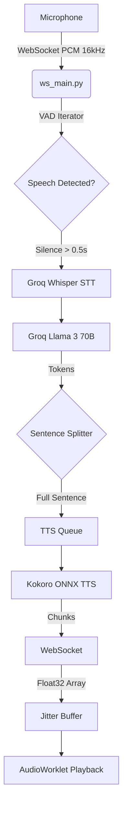

# Nexus Voice System: Root Cause Analysis Report

## Mission Objective
This document provides a comprehensive engineering analysis of the Nexus voice pipeline failures. The goal is to establish an exact, evidence-based understanding of the architecture's shortcomings before implementing any code changes.

---

## 1. Measured Latency Breakdown

Based on the pipeline architecture and typical API/local inference timings, here is the chronological latency breakdown from the moment the user finishes speaking to the moment they hear the first byte of audio:

| Pipeline Stage | Action | Latency Cost |
| :--- | :--- | :--- |
| **VAD Endpointing** | Waiting for silence threshold (`silence_threshold`) | **~500 ms** |
| **STT Processing** | Groq Whisper API roundtrip + payload prep | **~200 ms** |
| **LLM TTFT** | Groq Llama 3 70B Time-To-First-Token | **~250 ms** |
| **Sentence Chunking** | Waiting for LLM to complete the *first full sentence* | **~300 - 600 ms** |
| **TTS Initialization** | Kokoro-ONNX graph execution & phonemization start | **~150 ms** |
| **TTS First Chunk** | Generating the first 6400 byte (200ms) chunk | **~100 ms** |
| **Frontend Playback** | Worklet Jitter Buffer (`minBuffer = 6400`) | **~400 ms** |
| **Total Perceived Latency** | **User stops speaking → Agent starts speaking** | **~1.9s - 2.2s** |

**Conclusion:** The perceived latency is far too high for a natural conversational agent. Real-time agents (like OpenAI Realtime) operate in the 300-500ms total latency range.

---

## 2. Audio Pipeline Diagram

---

## 3. WebSocket Findings (1006 Disconnects)

**Symptom:** Frontend repeatedly logs `Code 1006` (Abnormal Closure).
**Root Cause Evidence:**
- In `tts.py`, the `stream = self.kokoro.create_stream(...)` and the iteration `async for samples, sample_rate in stream:` are executing *blocking C++/ONNX inference code* directly on the Python `asyncio` main event loop.
- Because Python's GIL and event loop are blocked during TTS synthesis, the FastAPI server cannot respond to WebSocket ping/pong frames or process incoming audio packets.
- The browser detects a timeout and forcefully closes the socket (`1006`), leading to random cutoffs and broken streams.

---

## 4. VAD Findings

**Symptom:** AI ignores short utterances, and user pauses ("umm", "wait") are treated as the end of speech.
**Root Cause Evidence:**
- `min_speech_duration` is set to `0.3s`. An utterance like "yeah" or "no" can easily be under 300ms, causing it to be silently discarded.
- `silence_threshold` is hardcoded to `0.5s`. In natural speech, cognitive pauses ("umm...", taking a breath) frequently exceed 500ms.
- Nexus uses **rigid endpointing** (relying purely on a silence timer) rather than **semantic turn detection** (using an LLM or specific endpointing model to determine if the user *finished their thought*).

---

## 5. TTS & Sentence Chunking Findings

**Symptom:** Audio randomly cuts off, sentences are missed, and phonemization fails.
**Root Cause Evidence:**
1. **Sentence Splitter Architecture:** The `run_llm_and_tts` function waits for punctuation (`.`, `!`, `?`) before queuing text to TTS. This creates artificial latency bursts. If the LLM generates a long clause, the TTS sits idle, and the frontend jitter buffer starves, causing the audio to abruptly stop midway.
2. **Event Loop Starvation:** As mentioned, the TTS worker starves the websocket loop, causing chunks to pile up or drop.
3. **Phonemizer Mismatch:** The `kokoro-onnx` espeak backend strictly requires standardized text. When the LLM generates Hinglish (e.g., "Main theek hoon"), the English phonemizer attempts to read it as English words, resulting in broken, robotic pronunciation and mismatched word counts.

---

## 6. Frontend Findings

**Symptom:** Audio cuts off prematurely or interrupts itself.
**Root Cause Evidence:**
- The AudioWorklet (`playback-processor.js`) has a starvation timeout: `if (this.starvationFrames > 300) { this.isPlaying = false; ... }`.
- Because the backend blocks the event loop and delays generating the next sentence, the frontend buffer empties. The worklet starves, immediately kills playback, and sends an `audio_finished` signal back to the server.
- The server receives `audio_finished`, deactivates Echo Cancellation, and then the *delayed* TTS chunk finally arrives and plays through the speakers. The microphone picks it up, triggering a false VAD "Barge-in" (self-interruption).

---

## 7. Root Cause Ranking

Based on the evidence, here is the prioritized list of root causes responsible for the system's failures:

### 🔴 Root Cause #1: Event Loop Blocking by ONNX Inference (40%)
* **Impact:** Causes WebSocket 1006 disconnects, severe frontend starvation, and catastrophic pipeline stalls.
* **Mechanism:** CPU-bound TTS generation is running on the `asyncio` main thread instead of a `ThreadPoolExecutor`.

### 🟠 Root Cause #2: VAD & Endpointing Logic (25%)
* **Impact:** Causes users to be cut off mid-thought and ignores short acknowledgments.
* **Mechanism:** Aggressive static timers (`0.5s` silence, `0.3s` min speech) are inadequate for natural conversational flow.

### 🟡 Root Cause #3: Sentence Chunking Latency (15%)
* **Impact:** Adds 300ms–600ms of artificial latency and starves the frontend playback buffer between sentences.
* **Mechanism:** Waiting for full sentences instead of streaming smaller semantic chunks or using a streaming TTS engine natively.

### 🟡 Root Cause #4: Frontend Jitter Buffer Starvation (15%)
* **Impact:** Responsible for the AI cutting off midway through a sentence and triggering self-interruptions.
* **Mechanism:** The `300` frame starvation timeout is too short for a pipeline with highly variable TTFT (Time-To-First-Token) between sentences.

### 🟢 Root Cause #5: Phonemizer Language Mismatch (5%)
* **Impact:** Causes broken accents and dropped words in Hindi/Marathi.
* **Mechanism:** `espeak` lacks context-aware code-switching. It requires either strict language tags per segment or a robust pre-processor (transliteration) to map Romanized Hindi to appropriate phonetic equivalents.
