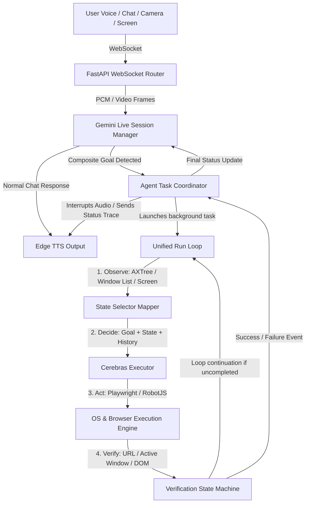
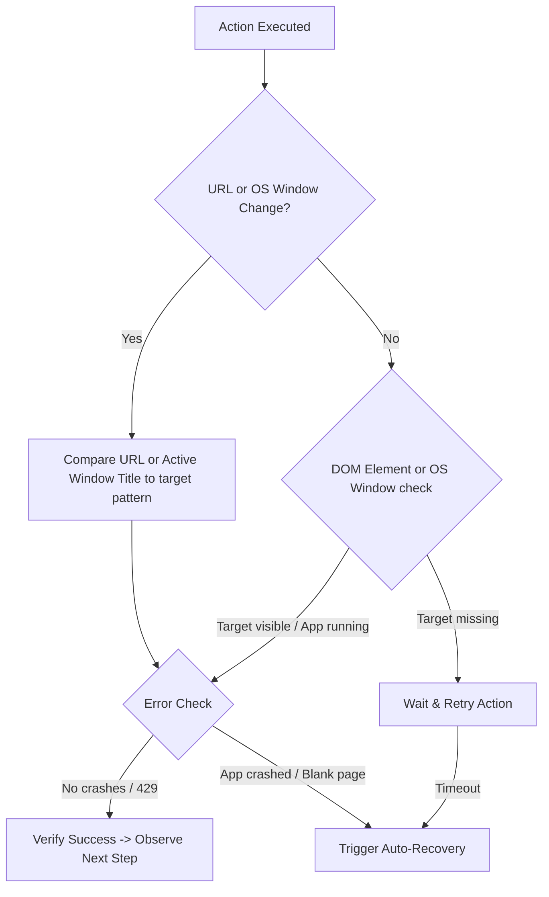
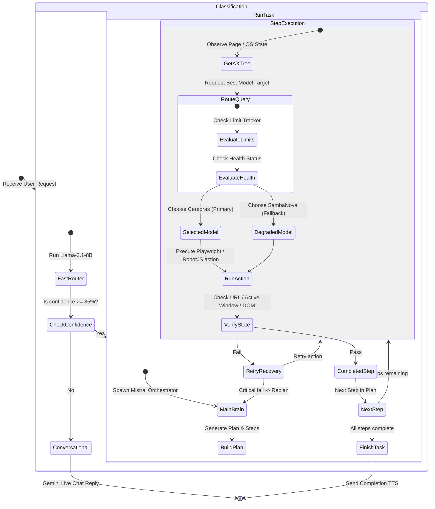
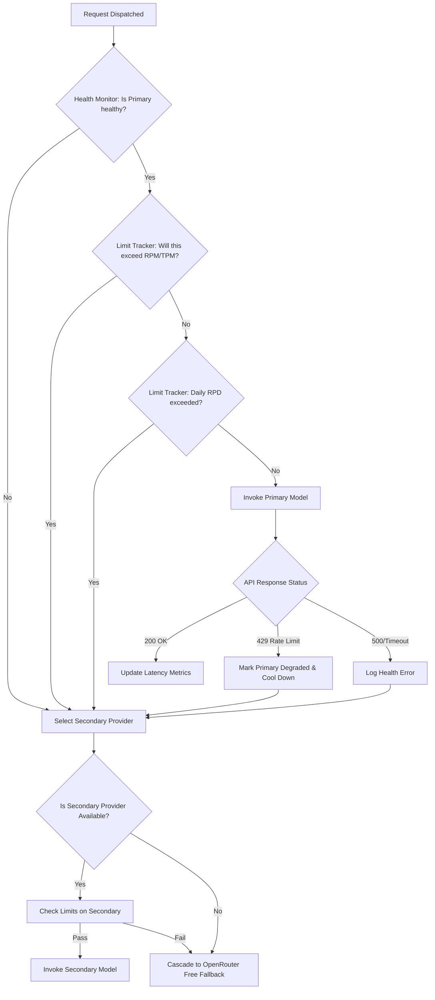

# Nexus Agentic Browser & PC Control Limit-Aware Strategy Research Report

## 1. Executive Summary

Nexus V1 currently faces a "single-intent bottleneck." When a user issues a composite command (e.g., *"open chrome and play Zaalima on YouTube"* or *"open notepad and type shopping list"*), the Action Router maps the request to a single primitive and terminates immediately. The system is incapable of chaining browser/OS actions or verifying step completions.

To design the correct production-grade agentic approach for Nexus, this report analyzes and compares the browser and desktop control loops, model architectures, and state representation methods of three serious agentic desktop systems: **IRIS AI**, **Stonic AI**, and **Hermes Agent**. 

Furthermore, to prevent rate limit starvation, provider outages, and cost escalation, this report introduces the **Nexus Limit-Aware Orchestrator**. This system moves away from static model ownership toward **Dynamic Capability Routing**, choosing the best available model at runtime based on real-time RPM, TPM, RPD, concurrency, provider health, latency, and cost for both browser and OS-level automation tasks.

---

## 2. Agentic Systems Comparison Table

| Feature / Dimension | IRIS AI | Stonic AI | Hermes Agent | Recommended Nexus V1 Design |
| :--- | :--- | :--- | :--- | :--- |
| **Control Interface** | Electron Shell + Headless Puppeteer | Playwright Chromium (CDP) + RobotJS (Desktop) | Node.js `agent-browser` CLI + OS tools | Playwright (Browser) + RobotJS/OS API (PC) |
| **State Representation** | Cheerio HTML Parsing | Playwright AXTree + Fallback CDP AXTree + Desktop screenshots | Compact Accessibility Tree (`ariaSnapshot`) + Desktop API | `ariaSnapshot` (Web), Active Window Titles & compressed JPEG (PC) |
| **Element Selection** | Hardcoded DOM queries | `elementMap` (Web), Coordinate mappings & OCR (PC) | Ref selectors (`@e1`, `@e2`) | Dynamic Ref selector mapping (Web), OS active bounds (PC) |
| **Chaining Method** | None (Single-turn scrape) | Multi-turn Python Hermes Agent CLI | Sequential subprocess execution | Unified Observe-Decide-Act-Verify Loop |
| **Verification Method** | None | Execution contract callbacks | Assertion-based check functions | Multi-invariant check (URL, DOM, active window title) |
| **Model Assignment** | Static Gemini 2.5 | Static Hermes (Llama/Gemini) | Static Reasoning LLM | Limit-Aware Dynamic Routing |
| **Relaunch Recovery** | None | `_withAutoRecovery` decorator | Dynamic daemon timeouts | In-process auto-recovery decorator |
| **CDP Port Handling** | None | Scan `9222..9252` and reserve port | Single-port (`9222`) standard | Scan `9222..9252` with socket directories |
| **Token Cost / Turn** | N/A | High (~15K HTML tokens) | Low (~1.5K AXTree tokens) | Low (~1.5K AXTree tokens, ~50 Active Window tokens) |
| **Weakness** | Extremely brittle; no clicks | Heavy JS footprint in Electron | CLI start latency | Requires active CDP port tracking |

---

## 3. Recommended Nexus Architecture

To support composite goals without adding high latency or rate-limiting issues to the voice pipeline, Nexus must separate **Reasoning / Voice (Gemini Live)** from **Execution (BrowserAgent & PCAgent)**.



### Architectural Divisions:
1. **Real-time Interaction Layer (Gemini Live)**: Maintained as a single, persistent, low-latency audio/video stream. It acts as the conversational shell, handling ambient voice input, camera frames, and screen share frames.
2. **Intent Interception**: Llama-3.1-8B-Instant continues to act as the sub-second Action Router. If the router detects a composite command, it intercepts the input *before* sending it to Gemini Live, avoiding redundant reasoning steps.
3. **Execution Delegate (`BrowserAgent` & `PCAgent`)**: Runs as a separate background task. The voice loop is unblocked immediately; the user sees live execution logs (e.g., *"Opening Notepad..."*, *"Typing text..."*) stream to the frontend dashboard.
4. **Clean Boundary & Interrupted State**: If the user speaks while the desktop agent is running (barge-in), the FastAPI socket intercepts the audio, cancels the background execution loop, restores the OS/browser to an idle state, and lets Gemini Live respond.

---

## 4. Recommended Model Responsibility Matrix

Nexus will dynamically assign models using the capability routing matrix:

| Task Class | Primary Model | Backup Model | Justification |
| :--- | :--- | :--- | :--- |
| **FAST_ROUTING** | `llama-3.1-8b-instant` (Groq) | `gpt-oss-120b` (Cerebras) | Under 200ms latency, high JSON compliance. |
| **CHAT** | `gemini-2.5-flash-native-audio` | `gpt-oss-120b` (Cerebras) | Native audio streaming, low conversational latency. |
| **PLANNING** | `mistral-large-latest` (Mistral) | `llama-3.3-70b-versatile` (Groq) | High planning capability, precise JSON tool calls. |
| **BROWSER** | `gpt-oss-120b` (Cerebras) | `mixtral-8x7b-32768` (Groq) | Extreme RPM (1,000) handles dense AXTree loops without rate-limiting. |
| **PC_CONTROL** | `gpt-oss-120b` (Cerebras) | `llama-3.3-70b-versatile` (Groq) | High speed, large context for parsing window hierarchies and shell commands. |
| **VISION** | `gemini-1.5-flash` | `pixtral-12b` (Mistral) | Native screenshot processing, fast OCR, element localization. |
| **LONG_CONTEXT** | `gpt-oss-120b` (Cerebras) | `gemini-1.5-pro` (Gemini) | Large AXTree history, application logs, and page dumps. |
| **CODE** | `codestral` (Mistral) | `llama-3.3-70b-versatile` (Groq) | Domain-specific coding models. |
| **RESEARCH** | `gpt-oss-120b` (Cerebras) | `mixtral-8x7b-32768` (Groq) | Large context RAG scans. |

---

## 5. Unified Browser & PC Control Loop

The automation loop uses the **Observe-Decide-Act-Verify** pattern, coordinating Web (Playwright) and Desktop (RobotJS/OS APIs) interfaces.

```
                  ┌──────────────────────────────────────────┐
                  │                 OBSERVE                  │
                  │  - Browser: Extract Compact AXTree      │
                  │  - PC: Query active window title/PID    │
                  │  - Capture low-resolution screenshot     │
                  └────────────────────┬─────────────────────┘
                                       │
                                       ▼
                  ┌──────────────────────────────────────────┐
                  │                 DECIDE                   │
                  │  - Send goal, step history, and state    │
                  │    to Cerebras (gpt-oss-120b)            │
                  │  - Model returns next action: click ref  │
                  │    (Web) or click coordinate (PC)        │
                  └────────────────────┬─────────────────────┘
                                       │
                                       ▼
                  ┌──────────────────────────────────────────┐
                  │                   ACT                    │
                  │  - Browser: Resolve ref via getByRole()  │
                  │  - PC: Move mouse / keyboard type        │
                  └────────────────────┬─────────────────────┘
                                       │
                                       ▼
                  ┌──────────────────────────────────────────┐
                  │                 VERIFY                   │
                  │  - Check URL state / Page Title          │
                  │  - Verify Active Window Process / Title  │
                  │  - Assert DOM element/text visibility    │
                  └──────────────────────────────────────────┘
```

### In-Depth Mechanics:

#### 1. Web State Resolution:
* Retretive accessibility tree using `page.locator(':root').ariaSnapshot()`, parse roles and assign sequential references (`e1`, `e2`). Unify selector resolution to use `getByRole().nth()` to prevent fragile locator breaks.

#### 2. PC State Resolution:
* **Active Window Tracking**: Call local OS APIs (PowerShell on Windows, `desktop-get-active-window` handler) to retrieve the foreground window title, process name, PID, and bounding box coordinates. This returns plain text (~50 tokens), avoiding the token cost of screenshots.
* **Running Application Scan**: Call `desktop-list-windows` to get the list of active applications to know if the target local application is already running.
* **Coordinate Mapping & Visual Localization**: If text-based window parameters are insufficient (e.g., we need to click a specific menu bar or button inside a legacy app), capture a desktop screenshot.

#### 3. Screenshot Compression Rules (Keep from Stonic):
Raw PNG screenshots are **2MB to 5MB**, translating to millions of multimodal tokens that exhaust rate limits and cause latency. Nexus must compress screenshots:
* Resize width to a maximum of **1280px** (preserving aspect ratio).
* Convert to JPEG format with a quality compression factor of **50%**.
* This reduces the file size to **50KB - 100KB**, rendering it extremely token-efficient for Gemini 1.5 Flash.

---

## 6. Recommended Verification Loop

Every automated action must be verified before proceeding to the next step. Moving forward blindly on a page or app that is still loading or crashed is the primary failure mode of desktop agents.



### Verification Invariants:
1. **URL & Process Checking**: Assert that the current URL (Web) or active process/window title (PC) matches expected navigation parameters. For example, after opening Notepad, verify the active process is `notepad` and the window title contains `Untitled - Notepad`.
2. **DOM & Control Visibility**: Assert that target element or typed text is visible. For text fields, read back the field value using `page.locator(selector).input_value()` or check the active field text using OS clipboard tools.
3. **CDP & OS Logs Monitoring**: Attach hooks to Playwright (console error logs) and listen to OS process exit codes to detect crashes instantly.

---

## 7. What to Keep from IRIS / Stonic / Hermes

1. **Keep from IRIS AI**:
   - **Background Scraping Summary**: If a user asks a query that doesn't require interaction (e.g., *"What is the latest repo change on GitHub?"*), skip the heavy headed browser and use a quick background scraper to get a summary to speak back to the user.
2. **Keep from Stonic AI**:
   - **CDP Port Reservation**: Scan a range of ports (`9222..9252`) at startup. Keep a dummy socket server listening to reserve the port, and release the reservation immediately prior to launching Chromium. This prevents port collisions with other CEF-based software.
   - **Desktop Control Handlers**: Keep the RobotJS and screen capture handlers. Use Electron's native `nativeImage` API to resize and compress screenshots down to 50-100KB JPEGs.
   - **Auto-Recovery Wrapper**: Wrap browser/OS calls in a decorator that intercepts target-closed/app-closed errors, runs `force_close()`, relaunch a fresh context, and retries the command once.
   - **Precision Locators**: The `role + name + nth` element map structure that resolves elements via `get_by_role().nth()` rather than fragile CSS classes.
3. **Keep from Hermes Agent**:
   - **AriaSnapshot Tree Compaction**: Extract the accessibility tree via `ariaSnapshot()`, stripping structural lines that have no interactive children. This drops token usage by ~90% and removes page layout noise.
   - **Isolated Browser Profile**: Launch Chromium with a distinct `userDataDir` under `nexus/data/browser_profile` to prevent session cookies from leaking or conflicting with the user's primary browser.

---

## 8. What to Avoid from Each

1. **Avoid from IRIS AI**:
   - **Hardcoded Heuristic Redirection**: Relying on regex keywords like `includes('youtube')` to construct search query strings. This does not scale to generic browser workflows.
   - **Shell Execution**: Opening pages in the user's system default browser via `shell.openExternal()`. The agent cannot control, read, or automate a window opened through the OS shell.
2. **Avoid from Stonic AI**:
   - **Code Bytecode Compilation**: Compiling JS files into V8 bytecode via `bytenode` to protect code. In Nexus V1, this creates heavy overhead, prevents hot-reloading, and complicates debugging.
   - **Too Many Primitives**: Exposing 46 separate API routes for basic browser actions. Nexus should stick to a clean, minimal set of 9 primitives.
3. **Avoid from Hermes Agent**:
   - **CLI Tool Spawning**: Running browser actions by spawning a CLI subprocess (`agent-browser`) on every step. This introduces massive process-spawning overhead (1-2s latency per action) and makes IPC state synchronization brittle. Keep the Playwright instance in-process.

---

## 9. What Nexus Should Implement First (Phase 1)

1. **Browser & OS Primitive Stabilization**:
   Refactor the 9 Playwright primitives in `browser_agent.py` and the local OS controls in `app_discovery.py` to return the unified JSON contract:
   ```json
   {
     "success": true,
     "verified": true,
     "execution_time": 0.45,
     "tool": "browser_click",
     "target": "e5",
     "error": null
   }
   ```
2. **CDP Port Reservation**:
   Add the startup port scanner (`9222..9252`) and dummy listener to `browser_agent.py` to prevent browser binding crashes.
3. **Auto-Recovery Decorator**:
   Implement the retry decorator on `browser_agent.py` and OS controllers to intercept window/app closes and handle relaunches transparently.
4. **AXTree Parsing (`ariaSnapshot`)**:
   Implement accessibility tree compaction and map sequential references (`e1`, `e2`, etc.) to Playwright's `get_by_role` selectors.

---

## 10. What Should Wait Until Later (Phase 2)

1. **Dynamic LLM Turn Chaining**:
   Integrating the Llama-3.3-70B model to dynamically plan and execute step-by-step browser/OS paths in the background. Initially, stick to static step lists or direct routing.
2. **Gemini Live Integration**:
   Teaching Gemini Live to emit structured `[GOAL: ...]` tokens and orchestrate the background delegate task.
3. **VNC / Live Stream Syncing**:
   Streaming low-res, base64 base screenshots over the WebSocket to render a live browser view on the frontend dashboard.
4. **Session Cookie Syncing**:
   Syncing cookies between the user's primary browser profile and the Nexus isolated profile for frictionless logins.

---

## 11. Nexus Provider Matrix (Deliverable 1)

This matrix compiles the context windows, rate limits, latency, cost, reliability, and ideal tasks for each provider available in the Nexus environment config (`docs/models_with_limits.md` and `.env`):

| Provider | Core Model | Context Window | RPM Limit | TPM Limit | RPD Limit | Avg Latency | Cost (per 1M tokens) | Reliability | Ideal Task Types |
| :--- | :--- | :--- | :--- | :--- | :--- | :--- | :--- | :--- | :--- |
| **Cerebras** | `gpt-oss-120b` | 131,000 | **1,000** | **1,000,000** | 1,440,000 | **Sub-100ms** | Free (Beta) | 99.9% | `BROWSER` loops, `PC_CONTROL` loops, `LONG_CONTEXT` parsing, `RESEARCH` scans |
| **Groq** | `llama-3.3-70b-versatile` | 8,192 | 30 (Free) | 6,000 (Free) | 14,400 | ~300ms | Free (Free) / $0.59 (Paid) | 99.8% | `PLANNING` backups, fast structured JSON reasoning |
| **Groq** | `llama-3.1-8b-instant` | 8,192 | 30 (Free) | 6,000 (Free) | 14,400 | **~150ms** | Free (Free) / $0.05 (Paid) | 99.8% | `FAST_ROUTING`, confidence scoring, simple parsing |
| **SambaNova**| `Meta-Llama-3.3-70B` | 8,192 | 240 (Dev) | Uncapped | Unlimited | ~400ms | $0.60 | 99.5% | `PLANNING`, structured tool calls, coding tasks |
| **Gemini** | `gemini-1.5-flash` | 1,048,576 | 15 (Free) | 1,000,000 | 1,500 | ~800ms | $0.075 | 99.9% | `VISION` screenshots, multi-modal tasks, normal chat fallback |
| **Gemini** | `gemini-1.5-pro` | 2,097,152 | 2 (Free) | 32,000 (Free) | 50 | ~1.5s | $1.25 | 99.7% | Deep multimodal analysis, massive document scanning |
| **Mistral** | `mistral-large-latest` | 128,000 | 60 (1 RPS) | Uncapped | Unlimited | ~1.2s | $2.00 | 99.9% | `PLANNING` (Main Brain orchestrator), complex reasoning |
| **DeepSeek** | `deepseek-chat` | 64,000 | Dynamic | Dynamic | Unlimited | ~2.5s (High load) | $0.14 | 92.0% (Frequent 429) | Long form chat, code generation |
| **OpenRouter**| `llama-3.3-70b:free` | 8,192 | 20 (Free) | Uncapped | 50 | ~800ms | Free | 85.0% (High congestion) | Free fallback planning |
| **HuggingFace**| `HF Serverless API` | Varies | Dynamic | Uncapped | 1,000 | ~1.5s | Free | 90.0% | Basic text transformations |

---

## 12. Nexus Limit-Aware Architecture (Deliverable 2)

To prevent rate-limit crashes and manage high-concurrency workloads, Nexus uses a four-layered Orchestration Architecture:

```
                               ┌─────────────────────────┐
                               │     Task Submission     │
                               └────────────#────────────┘
                                            │
                                            ▼
                               ┌─────────────────────────┐
                               │   Task Classification   │
                               │  (Fast Llama-3.1-8B)    │
                               └────────────┬────────────┘
                                            │
                                            ▼
                               ┌─────────────────────────┐
                               │  Orchestration Brain    │
                               │   (Mistral / Plan)      │
                               └────────────┬────────────┘
                                            │
                                            ▼
 ┌─────────────────────────────────────────────────────────────────────────────┐
 │                         PROVIDER SELECTION ENGINE                           │
 │                                                                             │
 │    ┌─────────────────────────┐   ┌─────────────────┐   ┌──────────────┐     │
 │    │    Provider Registry    │   │  Limit Tracker  │   │Health Monitor│     │
 │    │ (Specs, cost, capacity) │   │ (Sliding bucket)│   │(Latency, 429)│     │
 │    └────────────┬────────────┘   └────────┬────────┘   └──────┬───────┘     │
 │                 │                         │                   │             │
 │                 └─────────────────────────┼───────────────────┘             │
 │                                           ▼                                 │
 │                             Determines Best Model Target                    │
 └──────────────────────────────────────────┬──────────────────────────────────┘
                                            │
                                            ▼
                               ┌─────────────────────────┐
                               │     Fallback Engine     │
                               │   (Sequential Retry)    │
                               └────────────┬────────────┘
                                            │
                                            ▼
                               ┌─────────────────────────┐
                               │    Model Invocation     │
                               └─────────────────────────┘
```

### Components Detail:
1. **Provider Registry**: A centralized Python database module (`core/provider_registry.py`) that acts as the single source of truth for model specifications (Context Windows, RPM/TPM/RPD limits, relative pricing, concurrency caps).
2. **Limit Tracker**: Uses an in-memory **Token Bucket algorithm** via Redis/Valkey or in-process thread-safe dictionary structures. It tracks:
   - Request counts over the current 60-second window.
   - Accrued tokens processed in the current minute (TPM).
   - Daily request volume (RPD).
   - Currently active/pending concurrent requests.
   Before dispatching a request, the tracker simulates the token footprint. If it detects a high probability of a 429 breach, it blocks execution and routes to the fallback provider.
3. **Provider Health Monitor**: Listens to every API execution. It logs request latency (moving average over 5 runs), network timeouts, HTTP 5xx codes, and HTTP 429s. If a provider's error rate exceeds 20% or latency jumps by 3x, the monitor marks the provider as "degraded" and triggers a 5-minute cooldown.
4. **Fallback Engine**: Implements a cascading logic. If the primary model fails or is rate-blocked, it catches the exception and immediately invokes the secondary model from the fallback list without propagating the error to the user interface.

---

## 13. Nexus Orchestrator Flow (Deliverable 3)

The following state machine describes how a composite task is executed across the Limit-Aware system:



---

## 14. Provider Fallback Decision Tree (Deliverable 4)

This diagram details the selection logic when a model request is processed:



---

## 15. Recommended Production Routing Table (Deliverable 5)

This routing table defines the primary and secondary models to be chosen dynamically at runtime based on task classes:

| Task Class | Primary Model | Backup Model | Tertiary Fallback | Criteria / Trigger for Failover |
| :--- | :--- | :--- | :--- | :--- |
| **FAST_ROUTING** | `llama-3.1-8b-instant` (Groq) | `gpt-oss-120b` (Cerebras) | `llama-3.1-8b` (SambaNova) | Trigger fallback if Groq latency > 400ms or Groq RPM limits are hit. |
| **CHAT** | `gemini-2.5-flash-native-audio` (Gemini) | `gpt-oss-120b` (Cerebras) | `llama-3.3-70b-versatile` (Groq) | Trigger fallback if Gemini Live connection fails or 429 is encountered. |
| **PLANNING** | `mistral-large-latest` (Mistral) | `llama-3.3-70b-versatile` (Groq) | `Meta-Llama-3.3-70B` (SambaNova) | Trigger fallback if Mistral free limit of 1 RPS (60 RPM) is exceeded. |
| **BROWSER** | `gpt-oss-120b` (Cerebras) | `Meta-Llama-3.3-70B` (SambaNova) | `mixtral-8x7b-32768` (Groq) | Trigger fallback if Cerebras returns 429 or response time exceeds 1.5s. |
| **PC_CONTROL** | `gpt-oss-120b` (Cerebras) | `llama-3.3-70b-versatile` (Groq) | `Meta-Llama-3.3-70B` (SambaNova) | Trigger fallback if Cerebras limits are exhausted. |
| **VISION** | `gemini-1.5-flash` (Gemini) | `pixtral-12b` (Mistral) | `gemini-1.5-pro` (Gemini) | Trigger fallback if Gemini 15 RPM free-tier limit is reached. |
| **LONG_CONTEXT** | `gpt-oss-120b` (Cerebras) | `gemini-1.5-pro` (Gemini) | `mixtral-8x7b-32768` (Groq) | Trigger fallback if Cerebras token limit (1M TPM) is exceeded. |
| **CODE** | `codestral` (Mistral) | `Meta-Llama-3.3-70B` (SambaNova) | `llama-3.3-70b-versatile` (Groq) | Trigger fallback if Mistral return rate is blocked. |
| **RESEARCH** | `gpt-oss-120b` (Cerebras) | `mixtral-8x7b-32768` (Groq) | `llama-3.3-70b-versatile` (Groq) | Trigger fallback if Cerebras daily quota (2,000,000,000 TPD) is met. |

---

## 16. Specific Question Resolution: Mistral Large vs. Cerebras

### Question:
Based on actual limits, would Mistral Large be a better primary planner than Cerebras? Would Cerebras be better reserved for large context, browser loops, and research tasks instead of being permanently assigned as planner?

### Analysis & Evidence:

1. **Mistral Large Rate Limits & Context**:
   - **Limit (Free Tier)**: Mistral enforces a highly restrictive **1 Request Per Second (RPS)** rate limit, which equates to a maximum of 60 requests per minute (RPM). 
   - **Token Limit**: There is a strict monthly token quota.
   - **Cost**: Mistral Large is a premium model, priced at **$2.00 per million tokens** (if on a paid scale plan).
   - **Planning Strength**: Mistral Large possesses world-class reasoning, multi-turn plan maintenance, and complex structural tool-calling capabilities.

2. **Cerebras gpt-oss-120b Rate Limits & Context**:
   - **Limit (Beta/Standard)**: Cerebras provides a massive **1,000 Requests Per Minute (RPM)**, **60,000 Requests Per Hour (RPH)**, and **1,440,000 Requests Per Day (RPD)**.
   - **Token Limit**: Enforces a massive **1,000,000 Tokens Per Minute (TPM)** and **2,000,000,000 Tokens Per Day (TPD)**.
   - **Latency**: Sub-100ms response times powered by Language Processing Units (LPU wafer-scale hardware).
   - **Context Window**: 131,000 tokens.

3. **Rate Limit Starvation in Browser & OS Loops**:
   - Browser and OS automation require a high density of micro-turns: extracting the accessibility tree, querying active foreground windows, parsing references, checking element bounds, clicking, and verifying the state change.
   - A single multi-step task (e.g., searching for a song, clicking results, closing ads, playing, verifying) can generate **10 to 30 sequential model invocations in under 60 seconds**.
   - If **Mistral Large** is permanently assigned to run this loop, it will exhaust its **1 RPS (60 RPM)** limits within seconds, causing a complete system freeze or 429 failures. Furthermore, sending large AXTree snapshots (~1.5K tokens) on every micro-turn will quickly consume Mistral's monthly token budget.

### Conclusion & Recommendation:
* **Mistral Large** is **NOT** suitable as a primary micro-step planner. It must be reserved as the **Macro-Orchestrator / Main Brain**. It runs exactly once at the beginning of a user task to output the high-level plan (macro breakdown) and once at the end to summarize results, minimizing its rate footprint.
* **Cerebras (gpt-oss-120b)** should be reserved for the **Micro-Step execution loops** (both browser AXTree navigation and PC window controls). 
  - Its **1,000 RPM** and **1M TPM** limits easily absorb the high-frequency API call loops.
  - Its wafer-scale hardware eliminates the latency delays associated with sequential page/OS observations.
  - Its **131K context window** allows the agent to hold dense accessibility trees, window hierarchies, and complete step histories inside the context window.
