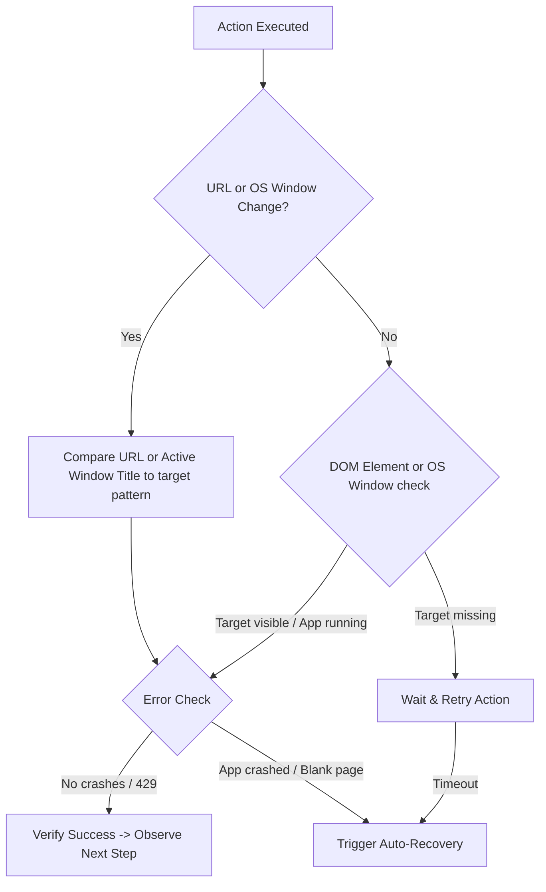

# Nexus Agentic Browser & PC Control Limit-Aware Strategy Research Report

## 1. Executive Summary

Nexus V1 currently faces a "single-intent bottleneck." When a user issues a composite command (e.g., *"open chrome and play Zaalima on YouTube"* or *"open notepad and type shopping list"*), the Action Router maps the request to a single primitive and terminates immediately. The system is incapable of chaining browser/OS actions or verifying step completions.

To design the correct production-grade agentic approach for Nexus, this report analyzes and compares the browser and desktop control loops, model architectures, and state representation methods of three serious agentic desktop systems: **IRIS AI**, **Stonic AI**, and **Hermes Agent**.

Furthermore, to prevent rate limit starvation, provider outages, and cost escalation, this report introduces the **Nexus Limit-Aware Orchestrator** structured around the **Shadow Monarch & Shadow Army Tier System**. This architecture moves away from static model ownership toward **Dynamic Capability Routing**, choosing the best available model at runtime based on real-time RPM, TPM, RPD, concurrency, provider health, latency, and cost for both browser and OS-level automation tasks.

Lastly, this report audits the current backend implementation of `browser_agent.py` to identify code quality gaps, evaluate load limits, specify anti-bot evasion mechanisms (WebGL/Canvas/TLS JA3/JA4 fingerprinting), and define how repetitive human-level work tasks are modeled as reusable, dynamic **Task Cards** rather than hardcoded scripts.

---

## 2. The Solo Leveling / Anime Theme Engine

To represent the agentic state visually, Nexus integrates a dynamic **Solo Leveling Rank Theme Engine**. When the orchestrator invokes a specific model tier (Shadow Soldier), the backend pushes a JSON styling stylesheet to the frontend React layout (`AnimeLayout.tsx`). The user interface adapts dynamically in real-time to reflect which class of agent is currently fighting through the task:

| Agent Grade              | Core Model       | UI Primary Color          | UI Accent Color      | Visual Theme & CSS Parameters                                                                             |
| :----------------------- | :--------------- | :------------------------ | :------------------- | :-------------------------------------------------------------------------------------------------------- |
| **Shadow Monarch** | User / Jinwoo    | `#0a0a14` (Obsidian)    | `#ffd700` (Gold)   | Deep charcoal background, glowing gold borders, premium particle trails, interactive HITL overlays.       |
| **Grand Marshal**  | Mistral Large    | `#0b091a` (Void Blue)   | `#8a2be2` (Indigo) | Semi-transparent dark violet panels, glowing purple borders, smooth easing transitions, serif typography. |
| **Generals**       | Cerebras 120B    | `#0e1626` (Steel Slate) | `#00f0ff` (Cyan)   | Neon cyan glowing panels, lightning animation borders, sub-100ms UI log streams, monospaced font headers. |
| **Knights**        | Groq Llama 8B    | `#1f1115` (Crimson Ink) | `#ff3b30` (Red)    | High-contrast crimson indicators, metal-grey card layouts, sharp borders, quick micro-interactions.       |
| **Eyes**           | Gemini 1.5 Flash | `#060f14` (Deep Teal)   | `#00ff66` (Green)  | Scanning green laser lines across elements, low-opacity glassmorphism, visual bounding-box highlights.    |
| **Infantry**       | Local System     | `#18181b` (Zinc Grey)   | `#a1a1aa` (Zinc)   | Flat retro-terminal layout, low-contrast text outputs, status tick indicators.                            |

---

## 3. Advanced Human Work Task Cards (Dynamic Catalog)

To prevent hardcoding specific tasks like lead gathering, social media posting, and document generation, Nexus structures workflows as reusable, dynamic **Task Cards**. Each card acts as an execution contract containing pre-conditions, instructions, loop handlers, and verification parameters.

```
                           ┌──────────────────────────────────┐
                           │          TASK CARD ENGINE        │
                           │   - Loads Card Configuration     │
                           │   - Resolves Pre-Conditions      │
                           └────────────────┬─────────────────┘
                                            │
                                            ▼
                           ┌──────────────────────────────────┐
                           │          DECISION STEPS          │
                           │  - Scrapes / Matches selectors   │
                           │  - Generates Step Loop Queries   │
                           └────────────────┬─────────────────┘
                                            │
                                            ▼
                           ┌──────────────────────────────────┐
                           │       VERIFICATION CONTRACTS     │
                           │  - Asserts DOM / URL conditions  │
                           │  - Triggers Fallback / Backtrack │
                           └──────────────────────────────────┘
```

### Card 1: B2B Lead Generation & Email Outreach (`leads_outreach_card.json`)

Allows the agent to search business directories, extract contact details, and execute an automated mailing sequence.

```json
{
  "card_id": "leads_outreach_v1",
  "task_class": "BROWSER",
  "inputs": {
    "search_url": "https://www.google.com/maps/search/software+agencies+in+Austin",
    "email_template": "Subject: Partnership Request\n\nHi {name},\nI noticed your work at {company}..."
  },
  "pre_conditions": {
    "network": "residential_proxy_required"
  },
  "workflow": [
    { "step": 1, "action": "open_url", "target": "{search_url}", "stop_on_fail": true },
    {
      "step": 2,
      "action": "custom_loop",
      "loop_condition": "elements_visible('.q2oYec')", 
      "max_iterations": 30,
      "sub_steps": [
        { "action": "click", "target": "e_list_item" },
        { "action": "extract_text", "selectors": { "company": "h1.DUwDvf", "website": "a[data-item-id='authority']", "phone": "button[data-item-id^='phone']" } },
        { "action": "save_to_leads_db" }
      ]
    },
    { "step": 3, "action": "email_dispatch_loop", "verification": { "check_smtp": "200_ok" } }
  ]
}
```

### Card 2: Freelance Proposal Bidding (`freelance_bidding_card.json`)

Enables the agent to scrape job postings on platforms like Upwork or Freelancer, evaluate matches using Mistral Large, draft a custom proposal, and post the bid.

```json
{
  "card_id": "freelance_bidding_v1",
  "task_class": "BROWSER",
  "inputs": {
    "platforms": ["upwork"],
    "keywords": ["React Developer", "FastAPI Engineer"],
    "rate_max": 75,
    "proposal_template": "Hey! I see you need a {role}. Here is how I can build this: {approach}..."
  },
  "pre_conditions": {
    "auth_required": true,
    "auth_cookies_session": "upwork_session_vault"
  },
  "workflow": [
    { "step": 1, "action": "load_cookies", "target": "upwork_session_vault" },
    { "step": 2, "action": "open_url", "target": "https://www.upwork.com/nx/jobs/search/?q=react+fastapi&sort=recency" },
    { "step": 3, "action": "extract_job_details", "selectors": { "job_card": "article.job-tile" } },
    { "step": 4, "action": "hitl_verify_bidding", "prompt": "Evaluate job fit and prompt Monarch for bid approval." }
  ]
}
```

### Card 3: Social Media Syndication (`social_media_posting_card.json`)

Schedules, formats, and publishes content on platforms like Twitter, LinkedIn, or Medium.

```json
{
  "card_id": "social_media_syndication_v1",
  "task_class": "BROWSER",
  "inputs": {
    "post_content": "Nexus Agentic loops are now live! Powered by a Limit-Aware Orchestrator.",
    "targets": ["twitter", "linkedin"]
  },
  "workflow": [
    { "step": 1, "action": "open_url", "target": "https://x.com/compose/post" },
    { "step": 2, "action": "type", "target": "[data-testid='tweetTextarea_0']", "text": "{post_content}" },
    { "step": 3, "action": "click", "target": "[data-testid='tweetButtonInline']" }
  ]
}
```

### Card 4: Document & Presentation Generation (`doc_ppt_generation_card.json`)

Invokes local Python packages (`python-docx` and `python-pptx`) to generate reports, PDFs, or slides dynamically without loading heavy web interface contexts.

```json
{
  "card_id": "report_generation_v1",
  "task_class": "PC_CONTROL",
  "inputs": {
    "data_source": "leads_sqlite_db",
    "format": "pptx",
    "theme": "dark_mode_anime"
  },
  "workflow": [
    { "step": 1, "action": "run_python_script", "target": "scripts/generate_ppt.py", "args": ["--db", "{data_source}", "--theme", "{theme}"] },
    { "step": 2, "action": "verify_file_exists", "target": "outputs/leads_report.pptx" }
  ]
}
```

### Card 5: Google Maps Scraper Card (`google_maps_leads.json`)

Scrapes business profiles, coordinates, review averages, and website links from Google Maps lists.

```json
{
  "card_id": "maps_leads_scraper_v1",
  "task_class": "BROWSER",
  "inputs": {
    "query": "restaurants in Austin",
    "output_file": "data/austin_restaurants.csv"
  },
  "workflow": [
    { "step": 1, "action": "open_url", "target": "https://www.google.com/maps" },
    { "step": 2, "action": "type", "target": "#searchboxinput", "text": "{query}" },
    { "step": 3, "action": "press_key", "target": "Enter" }
  ]
}
```

### Card 6: Target Domain Team Research Card (`domain_team_research.json`)

Navigates public corporate sites to extract public team structures, `/about` pages, and `/team` roles.

```json
{
  "card_id": "team_research_v1",
  "task_class": "BROWSER",
  "inputs": {
    "target_domain": ""
  },
  "workflow": [
    { "step": 1, "action": "open_url", "target": "https://{target_domain}" },
    { "step": 2, "action": "locate_links", "regex": "about|team|staff|people" },
    { "step": 3, "action": "extract_contact_details" }
  ]
}
```

---

## 4. PC Control Administrative Permission Guardrails & Policy Engine

Allowing an AI model to automate desktop controls (Notepad, Paint, mouse movements) introduces significant administrative security risks (destructive commands, unauthorized registry changes, deletion of personal directory files).

To secure Nexus, we establish an **OS Policy Engine (Administrative Guardrails)**:

### 1. Operations Classification Matrix:

* **Permitted (Safe)**: Mouse clicks on user windows, standard key strokes within user apps, opening standard executables (`notepad.exe`, `mspaint.exe`, standard web browsers), reading active window titles, copying/pasting from clipboard.
* **Restricted (Elevated)**: Writing system config files, modifying user startup scripts, installing new system services. Requires explicit user confirmation via the frontend Admin Authorization Modal.
* **Blocked (Destructive)**: Commands deleting key system folders (`del /s /q C:\Windows`, `rm -rf /`), formatting drives, modifying system registry files, launching elevated cmd/powershell consoles silently, downloading binary execution targets (`.exe`, `.msi`, `.bat`, `.ps1`) from unverified remote domains.

### 2. Guardrail Policy Pipeline:

```
           ┌────────────────────────────────────────┐
           │        Command / Keystroke Sent        │
           └───────────────────┬────────────────────┘
                               │
                               ▼
           ┌────────────────────────────────────────┐
           │        OS Guardrail Parser             │
           │  - Scans command parameters            │
           │  - Checks blacklist regex rules        │
           └───────────────────┬────────────────────┘
                               │
            ┌──────────────────┴──────────────────┐
            │                                     │
            ▼ (Blocked)                           ▼ (Restricted)
┌──────────────────────┐               ┌──────────────────────┐
│  Terminate Step      │               │ Trigger Admin Modal  │
│  Log Security Audit  │               │ Wait for User Click  │
└──────────────────────┘               └──────────┬───────────┘
                                                  │
                                                  ▼
                                       ┌──────────────────────┐
                                       │ Execute Task Step    │
                                       └──────────────────────┘
```

### 3. Local Admin HITL Authorization Modal:

If a restricted operation is requested:

1. The background orchestrator pauses step execution.
2. An event is dispatched to the client UI, popping an alert warning: *"Nexus is requesting permission to run: `cmd /c setup.exe`."*
3. Execution only resumes once the user (Shadow Monarch) clicks **Authorize**. If ignored or rejected, the step fails immediately and cascades to a safe retry route.

---

## 5. Hybrid Local-Cloud Resource Allocation Boundary

To make Nexus efficient on personal consumer laptops without overloading system resources or exhausting token capacities, we establish a **Hybrid Egress Allocation Boundary**:

### 1. Hard Resource Caps:

* **Local Disk Quota (Max 5GB)**: Used exclusively for local browser profiles, SQLite execution logs, compressed screenshot history, and text-to-speech audio greeting caches.
* **Local Memory Cap (Max 1GB)**: Restricts local Playwright and RobotJS workers from causing CPU/RAM thermal throttling.

### 2. Data Allocation Split:

* **Local SQLite (Immediate Memory)**: Stores active task progress, session context, immediate step parameters, and active cookie jars.
* **Cloud Supabase (Long-Term Storage)**: Offloads historical execution traces, scraped B2B lead datasets, large vector embedding indexes (pgvector), and diagnostic logs. Keeps the user's laptop clean and lightweight.

### 3. Secure BYOK (Bring Your Own Key) UI Configuration:

To remove the security liability of storing hardcoded API credentials on a central server:

1. The client React frontend provides a secure **Settings panel** where users input their personal API keys (Groq, Mistral, Cerebras, Gemini).
2. Keys are encrypted client-side using local keys and stored securely in browser storage.
3. On WebSocket connection, keys are passed inside the encrypted connection header (e.g. `X-Nexus-Keys`), allowing the backend runtime to invoke model queries in-memory without persisting credentials.

---

## 6. Evasion, Anti-Bot & Rate Limit Mitigation Architecture

Bypassing advanced security platforms (Cloudflare Turnstile, Akamai, DataDome) is a massive bottleneck. Standard automated browsers fail immediately due to leaks in the browser engine. The following five layers must be integrated to ensure stealth execution:

### 1. Browser Engine Hardening (Stealth Driver)

* **The Leak**: Chromium contains internal properties such as `window.navigator.webdriver = true` and unique variables like `cdc_adoQy234dfBLDFG` injected into the window context by ChromeDriver/DevTools protocols.
* **The Solution**: Implement a hardened browser framework (like **Camoufox** or a custom-built Playwright driver patched with `playwright-stealth`). This strips chromedriver variables and forces the browser to mimic real hardware signatures.

### 2. Coherent WebGL & Canvas Spoofing

* **The Leak**: Standard anti-detect methods simply block WebGL or return random hardware noise on canvas rendering. Anti-bot heuristics flag this immediately because real devices never have randomized graphic rendering values.
* **The Solution**: Inject static hardware rendering profiles. Map the user agent to a specific GPU family (e.g., if the user agent says macOS/Safari, spoof the WebGL renderer as `Apple GPU` with matching driver parameters).

### 3. JA3/JA4 TLS Fingerprint Matching

* **The Leak**: Anti-bot servers analyze the low-level TLS handshake (ciphers, extensions, curves). The signature of standard Playwright/Node requests differs noticeably from modern Chrome or Safari browsers.
* **The Solution**: Intercept connection setup and rewrite TLS profiles to match the expected browser version. Utilize libraries like `curl-impersonate` or configure Playwright to run through an upstream proxy (like NodeMaven residential proxies) that rewrites JA3 TLS handshakes.

### 4. Behavioral Humanization (Curves & Key Jitter)

* **The Leak**: Sudden coordinate jumps and instantaneous, zero-delay clicks (e.g., clicking exact center coordinates $(x, y)$ of a button) are instant bot tells.
* **The Solution**:
  * **Bezier Curve Tracking**: Calculate mouse movements using randomized Cubic Bezier curve paths.
  * **Sub-Pixel Jitter**: Introduce small, human-like mouse jitters as the cursor approaches the button.
  * **Keystroke Delay Simulation**: Type text with a randomized delay factor between keystrokes ($30\text{ms} - 120\text{ms}$) simulating typing variance.

### 5. High-DPI Screen Resolution Scaling

* **The Leak**: Clicks targeting raw coordinates obtained from compressed image resolutions (e.g. 1280px) miss the target on High-DPI displays (e.g., Apple Retina or 4K screens at 150% scaling).
* **The Solution**: Apply dynamic coordinate translation scaling using the OS Device Pixel Ratio:

  $$
  Y_{\text{target}} = Y_{\text{compressed}} \times \left( \frac{\text{OS Resolution Height}_{\text{physical}}}{720} \right) \times \text{OS Device Pixel Ratio}
  $$

  $$
  X_{\text{target}} = X_{\text{compressed}} \times \left( \frac{\text{OS Resolution Width}_{\text{physical}}}{1280} \right) \times \text{OS Device Pixel Ratio}
  $$

### 6. Rate Limit & Challenge Mitigation:

* **IP Pressure Tracking**: Calculates cumulative requests across active nodes. If a host threshold is reached, it inserts randomized delay pauses ($1.5\text{s} - 3.5\text{s}$) to avoid triggering 429 status codes.
* **Guest Search Plateau Resolution (Query Splitting)**: To prevent anonymous scrapers from hitting listing caps (like LinkedIn truncating anonymous searches to 90 results), the orchestrator splits a broad query into small slices (e.g., location × post date × keyword parameters) and dedupes the collected outputs.
* **Transparent 429 Handling**: If a 429 (Resource Exhausted) is encountered:
  1. The monitor calculates the recovery window using `Retry-After` headers.
  2. It triggers a background token-bucket delay queue to buffer subsequent requests.
  3. The agent continues execution transparently without interrupting the ongoing voice conversation or alert logs.

---

## 7. Draw.io MCP Flowchart: Nexus Orchestrator Loop

The following Draw.io XML flowchart represents the core Observe-Decide-Act-Verify cycle integrated with dynamic rank themes and permission guardrails. This XML can be copied directly and loaded into Draw.io: 

```xml
<mxfile host="Electron" modified="2026-06-20T12:00:00.000Z" agent="Antigravity" version="21.0.0" type="device">
  <diagram id="nexus-orchestrator-loop" name="Page-1">
    <mxGraphModel dx="1000" dy="1000" grid="1" gridSize="10" guides="1" tooltips="1" connect="1" arrows="1" fold="1" page="1" pageScale="1" pageWidth="1654" pageHeight="1169" adaptiveColors="auto" math="0" shadow="0">
      <root>
        <mxCell id="0" />
        <mxCell id="1" parent="0" />
      
        <!-- Header Title -->
        <mxCell id="title" value="NEXUS ORCHESTRATOR UNIFIED EXECUTION LOOP" style="text;html=1;strokeColor=none;fillColor=none;align=center;verticalAlign=middle;whiteSpace=wrap;rounded=0;fontStyle=1;fontSize=18;fontColor=#1a237e;" vertex="1" parent="1">
          <mxGeometry x="327" y="30" width="1000" height="40" as="geometry" />
        </mxCell>
      
        <!-- Start Node -->
        <mxCell id="start_node" value="START: Request Received" style="ellipse;whiteSpace=wrap;html=1;fillColor=#dae8fc;strokeColor=#6c8ebf;fontStyle=1;fontSize=12;" vertex="1" parent="1">
          <mxGeometry x="777" y="100" width="160" height="70" as="geometry" />
        </mxCell>
      
        <!-- Step 1: Observe -->
        <mxCell id="observe_node" value="OBSERVE STATE<br/>- Extract compacted AXTree<br/>- Query active OS window list" style="rounded=1;whiteSpace=wrap;html=1;fillColor=#dae8fc;strokeColor=#6c8ebf;fontSize=12;" vertex="1" parent="1">
          <mxGeometry x="757" y="220" width="200" height="80" as="geometry" />
        </mxCell>
      
        <!-- Step 2: Decide -->
        <mxCell id="decide_node" value="DECIDE STEP<br/>- Evaluate limits & health<br/>- Select model target (Cerebras)<br/>- Apply Rank Theme visual state" style="rounded=1;whiteSpace=wrap;html=1;fillColor=#dae8fc;strokeColor=#6c8ebf;fontSize=12;" vertex="1" parent="1">
          <mxGeometry x="757" y="350" width="200" height="80" as="geometry" />
        </mxCell>
      
        <!-- Step 3: Guardrail check -->
        <mxCell id="guard_node" value="Is Action Safe?" style="rhombus;whiteSpace=wrap;html=1;fillColor=#fff2cc;strokeColor=#d6b656;fontSize=12;" vertex="1" parent="1">
          <mxGeometry x="787" y="480" width="140" height="100" as="geometry" />
        </mxCell>

        <!-- Step 4: Act (Safe path) -->
        <mxCell id="act_node" value="ACT<br/>- Execute Playwright selector<br/>- Execute RobotJS mouse move" style="rounded=1;whiteSpace=wrap;html=1;fillColor=#d5e8d4;strokeColor=#82b366;fontSize=12;" vertex="1" parent="1">
          <mxGeometry x="757" y="630" width="200" height="80" as="geometry" />
        </mxCell>

        <!-- Admin Modal Check (Restricted path) -->
        <mxCell id="admin_modal" value="Trigger HITL Admin<br/>Authorization Modal" style="rounded=1;whiteSpace=wrap;html=1;fillColor=#ffe6cc;strokeColor=#d6b656;fontSize=12;" vertex="1" parent="1">
          <mxGeometry x="500" y="490" width="180" height="80" as="geometry" />
        </mxCell>

        <!-- Block / Terminate (Unsafe path) -->
        <mxCell id="terminate_node" value="Block Operation & Log<br/>Security Violation" style="rounded=1;whiteSpace=wrap;html=1;fillColor=#f8cecc;strokeColor=#b85450;fontSize=12;" vertex="1" parent="1">
          <mxGeometry x="1020" y="490" width="180" height="80" as="geometry" />
        </mxCell>
      
        <!-- Connectors -->
        <mxCell id="e1" style="edgeStyle=orthogonalEdgeStyle;rounded=1;html=1;fontSize=12;strokeColor=#555555;" edge="1" parent="1" source="start_node" target="observe_node">
          <mxGeometry relative="1" as="geometry" />
        </mxCell>
        <mxCell id="e2" style="edgeStyle=orthogonalEdgeStyle;rounded=1;html=1;fontSize=12;strokeColor=#555555;" edge="1" parent="1" source="observe_node" target="decide_node">
          <mxGeometry relative="1" as="geometry" />
        </mxCell>
        <mxCell id="e3" style="edgeStyle=orthogonalEdgeStyle;rounded=1;html=1;fontSize=12;strokeColor=#555555;" edge="1" parent="1" source="decide_node" target="guard_node">
          <mxGeometry relative="1" as="geometry" />
        </mxCell>
        <mxCell id="e4" value="Yes" style="edgeStyle=orthogonalEdgeStyle;rounded=1;html=1;fontSize=12;strokeColor=#555555;" edge="1" parent="1" source="guard_node" target="act_node">
          <mxGeometry relative="1" as="geometry" />
        </mxCell>
        <mxCell id="e5" value="Restricted" style="edgeStyle=orthogonalEdgeStyle;rounded=1;html=1;fontSize=12;strokeColor=#555555;" edge="1" parent="1" source="guard_node" target="admin_modal">
          <mxGeometry relative="1" as="geometry" />
        </mxCell>
        <mxCell id="e6" value="No" style="edgeStyle=orthogonalEdgeStyle;rounded=1;html=1;fontSize=12;strokeColor=#555555;" edge="1" parent="1" source="guard_node" target="terminate_node">
          <mxGeometry relative="1" as="geometry" />
        </mxCell>
        <mxCell id="e7" style="edgeStyle=orthogonalEdgeStyle;rounded=1;html=1;fontSize=12;strokeColor=#555555;" edge="1" parent="1" source="admin_modal" target="act_node">
          <mxGeometry relative="1" as="geometry" />
        </mxCell>
      
        <!-- Legend Box (Bottom-Left) -->
        <mxCell id="legend_bg" value="<b>LEGEND</b>" style="swimlane;startSize=24;fillColor=#f5f5f5;strokeColor=#cccccc;html=1;fontSize=11;align=center;" vertex="1" parent="1">
          <mxGeometry x="50" y="800" width="280" height="220" as="geometry" />
        </mxCell>
        <mxCell id="legend_process" value="Process / Flow" style="rounded=1;whiteSpace=wrap;html=1;fillColor=#dae8fc;strokeColor=#6c8ebf;fontSize=11;" vertex="1" parent="legend_bg">
          <mxGeometry x="10" y="35" width="120" height="25" as="geometry" />
        </mxCell>
        <mxCell id="legend_problem" value="Problems" style="rounded=1;whiteSpace=wrap;html=1;fillColor=#ffe6cc;strokeColor=#d6b656;fontSize=11;" vertex="1" parent="legend_bg">
          <mxGeometry x="140" y="35" width="120" height="25" as="geometry" />
        </mxCell>
        <mxCell id="legend_impact" value="Impact" style="rounded=1;whiteSpace=wrap;html=1;fillColor=#f8cecc;strokeColor=#b85450;fontSize=11;" vertex="1" parent="legend_bg">
          <mxGeometry x="10" y="70" width="120" height="25" as="geometry" />
        </mxCell>
        <mxCell id="legend_solution" value="Solutions" style="rounded=1;whiteSpace=wrap;html=1;fillColor=#d5e8d4;strokeColor=#82b366;fontSize=11;" vertex="1" parent="legend_bg">
          <mxGeometry x="140" y="70" width="120" height="25" as="geometry" />
        </mxCell>
        <mxCell id="legend_ref" value="Reference / Docs" style="rounded=1;whiteSpace=wrap;html=1;fillColor=#e1d5e7;strokeColor=#9673a6;fontSize=11;" vertex="1" parent="legend_bg">
          <mxGeometry x="10" y="105" width="120" height="25" as="geometry" />
        </mxCell>
      
        <!-- Scope Box -->
        <mxCell id="scope_box" value="<b>Scope:</b> Nexus Orchestration Security Policy<br/><b>Author:</b> Antigravity Agent<br/><b>Date:</b> 2026-06-20" style="rounded=1;whiteSpace=wrap;html=1;fillColor=#f5f5f5;strokeColor=#cccccc;align=left;spacingLeft=10;fontSize=11;html=1;" vertex="1" parent="1">
          <mxGeometry x="50" y="1040" width="280" height="70" as="geometry" />
        </mxCell>
      </root>
    </mxGraphModel>
  </diagram>
</mxfile>
```

---

## 8. Agentic Systems Comparison Table

| Feature / Dimension            | IRIS AI                             | Stonic AI                                                     | Hermes Agent                                                | Recommended Nexus V1 Design                                         |
| :----------------------------- | :---------------------------------- | :------------------------------------------------------------ | :---------------------------------------------------------- | :------------------------------------------------------------------ |
| **Control Interface**    | Electron Shell + Headless Puppeteer | Playwright Chromium (CDP) + RobotJS (Desktop)                 | Node.js `agent-browser` CLI + OS tools                    | Playwright (Browser) + RobotJS/OS API (PC)                          |
| **State Representation** | Cheerio HTML Parsing                | Playwright AXTree + Fallback CDP AXTree + Desktop screenshots | Compact Accessibility Tree (`ariaSnapshot`) + Desktop API | `ariaSnapshot` (Web), Active Window Titles & compressed JPEG (PC) |
| **Element Selection**    | Hardcoded DOM queries               | `elementMap` (Web), Coordinate mappings & OCR (PC)          | Ref selectors (`@e1`, `@e2`)                            | Dynamic Ref selector mapping (Web), OS active bounds (PC)           |
| **Chaining Method**      | None (Single-turn scrape)           | Multi-turn Python Hermes Agent CLI                            | Sequential subprocess execution                             | Unified Observe-Decide-Act-Verify Loop                              |
| **Verification Method**  | None                                | Execution contract callbacks                                  | Assertion-based check functions                             | Multi-invariant check (URL, DOM, active window title)               |
| **Model Assignment**     | Static Gemini 2.5                   | Static Hermes (Llama/Gemini)                                  | Static Reasoning LLM                                        | Limit-Aware Dynamic Routing (Shadow Army)                           |
| **Relaunch Recovery**    | None                                | `_withAutoRecovery` decorator                               | Dynamic daemon timeouts                                     | In-process auto-recovery decorator                                  |
| **CDP Port Handling**    | None                                | Scan `9222..9252` and reserve port                          | Single-port (`9222`) standard                             | Scan `9222..9252` with socket directories                         |
| **Token Cost / Turn**    | N/A                                 | High (~15K HTML tokens)                                       | Low (~1.5K AXTree tokens)                                   | Low (~1.5K AXTree tokens, ~50 Active Window tokens)                 |
| **Weakness**             | Extremely brittle; no clicks        | Heavy JS footprint in Electron                                | CLI start latency                                           | Requires active CDP port tracking                                   |

---

## 9. Recommended Model Responsibility Matrix

Nexus will dynamically assign models using the capability routing matrix:

| Task Class             | Primary Model                      | Backup Model                       | Justification                                                                |
| :--------------------- | :--------------------------------- | :--------------------------------- | :--------------------------------------------------------------------------- |
| **FAST_ROUTING** | `llama-3.1-8b-instant` (Groq)    | `gpt-oss-120b` (Cerebras)        | Under 200ms latency, high JSON compliance.                                   |
| **CHAT**         | `gemini-2.5-flash-native-audio`  | `gpt-oss-120b` (Cerebras)        | Native audio streaming, low conversational latency.                          |
| **PLANNING**     | `mistral-large-latest` (Mistral) | `llama-3.3-70b-versatile` (Groq) | High planning capability, precise JSON tool calls.                           |
| **BROWSER**      | `gpt-oss-120b` (Cerebras)        | `mixtral-8x7b-32768` (Groq)      | Extreme RPM (1,000) handles dense AXTree loops without rate-limiting.        |
| **PC_CONTROL**   | `gpt-oss-120b` (Cerebras)        | `llama-3.3-70b-versatile` (Groq) | High speed, large context for parsing window hierarchies and shell commands. |
| **VISION**       | `gemini-1.5-flash`               | `pixtral-12b` (Mistral)          | Native screenshot processing, fast OCR, element localization.                |
| **LONG_CONTEXT** | `gpt-oss-120b` (Cerebras)        | `gemini-1.5-pro` (Gemini)        | Large AXTree history, application logs, and page dumps.                      |
| **CODE**         | `codestral` (Mistral)            | `llama-3.3-70b-versatile` (Groq) | Domain-specific coding models.                                               |
| **RESEARCH**     | `gpt-oss-120b` (Cerebras)        | `mixtral-8x7b-32768` (Groq)      | Large context RAG scans.                                                     |

---

## 10. Unified Browser & PC Control Loop

The automation loop uses the **Observe-Decide-Act-Verify** pattern, coordinating Web (Playwright) and Desktop (RobotJS/OS APIs) interfaces.

```
                  ┌──────────────────────────────────────────┐
                  │                 OBSERVE                  │
                  │  - Browser: Extract Compact AXTree      │
                  │  - PC: Query active window title/PID    │
                  │  - Capture low-resolution screenshot     │
                  └────────────────────┬─────────────────────┘
                                       │
                                       ▼
                  ┌──────────────────────────────────────────┐
                  │                 DECIDE                   │
                  │  - Send goal, step history, and state    │
                  │    to Cerebras (gpt-oss-120b)            │
                  │  - Model returns next action: click ref  │
                  │    (Web) or click coordinate (PC)        │
                  └────────────────────┬─────────────────────┘
                                       │
                                       ▼
                  ┌──────────────────────────────────────────┐
                  │                   ACT                    │
                  │  - Browser: Resolve ref via getByRole()  │
                  │  - PC: Move mouse / keyboard type        │
                  └────────────────────┬─────────────────────┘
                                       │
                                       ▼
                  ┌──────────────────────────────────────────┐
                  │                 VERIFY                   │
                  │  - Check URL state / Page Title          │
                  │  - Verify Active Window Process / Title  │
                  │  - Assert DOM element/text visibility    │
                  └──────────────────────────────────────────┘
```

### In-Depth Mechanics:

#### 1. Web State Resolution:

* Retrieve accessibility tree using `page.locator(':root').ariaSnapshot()`, parse roles and assign sequential references (`e1`, `e2`). Unify selector resolution to use `getByRole().nth()` to prevent fragile locator breaks.

#### 2. PC State Resolution:

* **Active Window Tracking**: Call local OS APIs (PowerShell on Windows, `desktop-get-active-window` handler) to retrieve the foreground window title, process name, PID, and bounding box coordinates. This returns plain text (~50 tokens), avoiding the token cost of screenshots.
* **Running Application Scan**: Call `desktop-list-windows` to get the list of active applications to know if the target local application is already running.
* **Coordinate Mapping & Visual Localization**: If text-based window parameters are insufficient (e.g., we need to click a specific menu bar or button inside a legacy app), capture a desktop screenshot.

#### 3. Screenshot Compression Rules (Keep from Stonic):

Raw PNG screenshots are **2MB to 5MB**, translating to millions of multimodal tokens that exhaust rate limits and cause latency. Nexus must compress screenshots:

* Resize width to a maximum of **1280px** (preserving aspect ratio).
* Convert to JPEG format with a quality compression factor of **50%**.
* This reduces the file size to **50KB - 100KB**, rendering it extremely token-efficient for Gemini 1.5 Flash.

---

## 11. Recommended Verification Loop

Every automated action must be verified before proceeding to the next step. Moving forward blindly on a page or app that is still loading or crashed is the primary failure mode of desktop agents.



### Verification Invariants:

1. **URL & Process Checking**: Assert that the current URL (Web) or active process/window title (PC) matches expected navigation parameters. For example, after opening Notepad, verify the active process is `notepad` and the window title contains `Untitled - Notepad`.
2. **DOM & Control Visibility**: Assert that target element or typed text is visible. For text fields, read back the field value using `page.locator(selector).input_value()` or check the active field text using OS clipboard tools.
3. **CDP & OS Logs Monitoring**: Attach hooks to Playwright (console error logs) and listen to OS process exit codes to detect crashes instantly.

---

## 12. Next-Level OpenClaw Gaps & Advanced Implementation Challenges

To elevate Nexus V1 into a next-level agentic desktop control system (a highly-scalable custom OpenClaw), we must address six advanced engineering challenges:

### 1. Loop Backtracking & Self-Correction

* **The Gap**: Traditional pipelines fail permanently if a click navigates to the wrong page or triggers an unexpected overlay (e.g. pop-up ads).
* **The Solution**: Nexus must implement **Execution Backtracking**. If the Verification step fails, the agent records the failed node reference as a *blacklist element*, executes `page.go_back()` (Web) or presses `Alt + Tab / Esc` (PC), re-evaluates the previous state, and makes an alternative decision.

### 2. High-DPI Visual Coordinate Scaling

* **The Gap**: Clicks targeting raw coordinates obtained from compressed image resolutions (e.g. 1280px) miss the target on high-DPI screens (e.g., 4K monitors or Apple Retinas with 150% scaling).
* **The Solution**: All coordinates must be scaled using dynamic screen density formulas based on device metrics.

### 3. List Compaction & Context Pruning

* **The Gap**: On data-heavy pages (like Amazon product searches or complex directories), AXTree parsing can still exceed 8,000 tokens, introducing unnecessary noise and slowing down Cerebras.
* **The Solution**: Implement a **Heuristic Compact Filter** that identifies repeating structural list sibling nodes (e.g., product listing rows) and collapses them into a single reference block (e.g., `"- [ref=e10] 24 repeating product rows truncated"`).

### 4. Cross-App Clipboard State Persistence

* **The Gap**: Automation loops cannot pass data between separate contexts (e.g., copying text from a web page and pasting it into Notepad) without an intermediate memory bridge.
* **The Solution**: Create a **Global OS Clipboard Bridge**. The orchestrator maintains a `shared_context` dictionary where copied variables are persisted, allowing the `BrowserAgent` to write variables that `PCAgent` retrieves and types.

### 5. Keystroke & Interaction Buffering

* **The Gap**: Triggering individual mouse movement packets or sequential keystrokes over individual websocket frames introduces massive network latency and rate limits.
* **The Solution**: Implement **Keystroke Micro-Batching**. The planner returns macro sequences (e.g. `type_sequence("@e3", "text_string", submit=True)`), which are executed locally as a single batched OS command.

### 6. Human-in-the-Loop (HITL) Safety Gate

* **The Gap**: Automated models can make destructive decisions (deleting directories, making payments, entering secure credentials).
* **The Solution**: Introduce a **Strict HITL Gate**. Identify a list of high-risk commands (e.g., files deletions, clipboard writes of passwords, financial urls). When detected, the orchestrator halts background loops, triggers a frontend modal (confirm/deny), and only resumes execution after manual confirmation.
