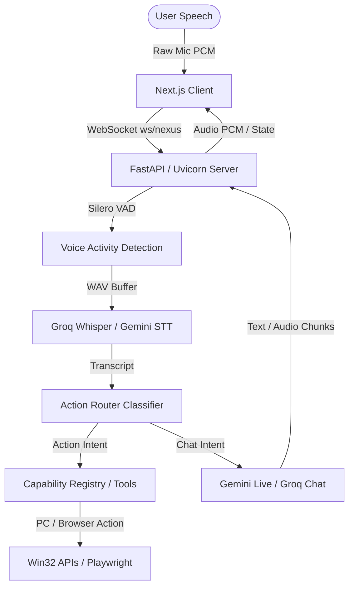

# 07 – Architecture Documentation

This document serves as the high-level source of truth for the Nexus core architecture, pipeline execution stages, logical components, database models, and operational standards.

---

## 1. System Overview

Nexus is a voice-first AI assistant designed for Windows desktop control, local document scraping, and real-time conversation. It consists of two major sub-modules:

1.  **Frontend (Next.js)**: A client UI running on port `3939` that handles microphone audio capture, Web Audio API playback, and real-time state telemetry.
2.  **Backend (Python)**: A Uvicorn server running on port `8001` (managed under `backend/nexus_core/`) that orchestrates voice activity detection (VAD), speech-to-text (STT), intent classification, capability execution, and text-to-speech (TTS).

---

## 2. Voice & Pipeline Execution

### 2.1 Outbound Audio Capture (Client)
*   **Media Devices:** Captured via `navigator.mediaDevices.getUserMedia` with echo cancellation and noise suppression enabled.
*   **Audio Processor:** Streamed into an `AudioContext` and processed through a custom `AudioWorkletNode` (`voice-processor.js`) at 16kHz, 16-bit Mono PCM.
*   **WebSocket Ingestion:** Chunks are buffered locally and sent over the WebSocket connection (`/ws/nexus` or `/ws/gemini-live`) in raw binary format.

### 2.2 Voice Activity Detection (VAD) & Transcription (Backend)
*   **VAD Iterator:** Raw binary PCM chunks are streamed into a Silero VAD model. The system gates listening to avoid echo interference during AI speech.
*   **Speech End & Transcription:** When the VAD iterator flags a speech end, the accumulated PCM buffer is normalized and sent to **Groq STT (Whisper-large-v3)**.
*   **STT Fallback:** If Groq fails (key missing or network issue), the backend falls back to **Gemini 2.5 Flash** for direct audio file transcription.
*   **Hallucination Filter:** Segment probabilities (`no_speech_prob` and `avg_logprob`) are checked to reject voice noise or empty room hallucinations.

### 2.3 Semantic Intent Routing (Action Router)
Once the transcript is generated, it is passed through the `ActionRouter` (running on `llama-3.1-8b-instant` with temperature `0.0` for structural JSON output) to categorize the intent:
*   **Action Intent:** If the transcript matches command keywords (e.g. `open chrome`, `close notepad`), the router extracts the capability name and target parameters.
*   **Chat Intent:** If no tool matches, the input is classified as general conversation (`null` tool).

### 2.4 Response Generation & Synthesis
*   **Gemini Live Mode:** The text transcript is forwarded to the Gemini Multimodal Live API (`gemini-2.5-flash-native-audio-latest`) via WebSockets. The model generates audio PCM chunks directly, which the backend proxies back to the client.
*   **Groq Chat Mode:** The transcript is sent to a standard Groq completion API (`llama-3.3-70b-versatile`). The returned text stream is parsed into semantic phrase/sentence chunks, synthesized into audio via **EdgeTTS** (`en-IN-PrabhatNeural` or `en-IN-NeerjaNeural`), and sent to the client.

---

## 3. Database Schema & State Management

The backend uses a local **SQLite database (WAL Mode)** located at `backend/nexus_core/data/nexus_core.db`. It consists of the following key tables:

*   `users`: Stores user profile entries (e.g., ID, name).
*   `workspaces`: Represents the environment grouping (default is "Nexus").
*   `sessions` & `messages`: Persists the chat history and message metadata.
*   `user_memory`: Handles long-term facts and preferences grouped by category.
*   `capabilities` & `user_permissions`: Registers the 18 active capabilities and stores RBAC approval state.
*   `discovered_apps`: Caches local application executable paths and aliases for PC Control launch.
*   `verification_matrix`: Stores E2E test runs, features status, and verification metrics.

---

## 4. Verification Standards

*   Every backend capability and pipeline feature is verified automatically using the test suite in `backend/nexus_core/test_v1.py`.
*   All tests must pass cleanly. Any diagnostic failures or database size growths are treated as production blockers.
